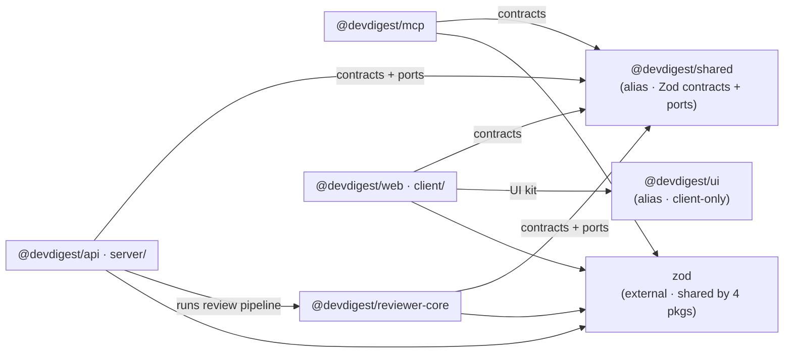

# Step 2 — Draw the dependency graph

Produce **one** Mermaid `flowchart LR`. It shows structure, not every edge — a readable graph beats
an exhaustive one.

Include:

- **One subgraph per package** in scope, labeled with the package name (`@devdigest/api`, …).
- **Internal edges** between packages for each alias / cross-package import, labeled with the alias
  or a short description (e.g. `types via shared`). This is the primary content.
- **External nodes** only for dependencies that are **large** (>5 MB installed) **or shared across
  ≥2 packages** — draw one shared node (e.g. `zod`) with an edge to each consumer, never one node
  per package per dep.
- **Direct imports only** — never transitive dependencies.

Exclude: tooling devDeps (vitest/tsc/eslint/…), and client-internal aliases (`@/*`, `@messages/*`)
that don't cross a package boundary.

If the graph would exceed ~20 nodes, collapse single-edge leaf packages into a "misc" note and
**state what was collapsed** — never drop nodes silently.

## Example — grounded in this repo's real edges

Read this graph as: everything depends on `@devdigest/shared`; only `server` reaches into
`reviewer-core`; `zod` is the one npm package shared repo-wide (the version-drift suspect). Adapt
the nodes/edges to what Step 1 actually found — do not emit the example verbatim if the real edges
differ.

See the `mermaid-diagram` skill for syntax beyond this flowchart.
