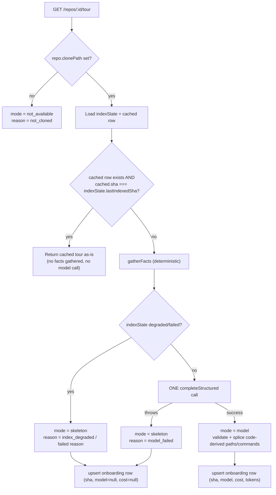

# Onboarding Generator

The Onboarding Tour (`/tour`) turns a repo's `repo-intel` index into a
first-day narrative: architecture, critical paths, how to run locally, a
guided reading path, and first tasks. Like Project Context, the design
principle is **code gathers facts, the model only writes narrative** — every
file path, dependency chain, and run command the tour shows a user is
computed deterministically before the (single, optional) LLM call, never
authored by the model
(`server/src/modules/onboarding/facts.ts:8-13`, `sections.ts:16-25`).

## Facts vs. narrative split

1. **`gatherFacts`** (`server/src/modules/onboarding/facts.ts:46-87`) makes
   zero model calls. It pulls, in parallel, the repo's top-ranked files
   (`repoIntel.getTopFilesByRank`, 15 files), dependency chains
   (`getCriticalPaths`), a reachable-routes/crons map for those seed files
   (`getReachableFacts`), and a fixed-token-budget repo skeleton
   (`getRepoMap`) — all through the `repoIntel` facade's own fixed read
   budgets, so the generator has no size threshold of its own
   (`facts.ts:44-45`). It also derives run commands straight from the
   clone's `package.json` `scripts` (guarded, size-capped read via
   `resolveInClone` + `MAX_FILE_SIZE`, `facts.ts:94-105`,
   `server/src/modules/repo-intel/constants.ts:43`), prioritized
   `dev, start, build, test`, prefixed by the detected package manager
   (`pnpm`/`yarn`/`npm` from lockfile presence, `facts.ts:107-132`).
2. Every real path surfaced by these facts is unioned into
   `allowedPaths` (`facts.ts:66-69`) — the allowlist `validatePaths`
   (`sections.ts:16-25`) filters the model's `critical_paths`/`reading_path`
   items against, silently dropping any path the model invents.
3. **The model** (one `completeStructured` call, `service.ts:131-139`) only
   ever contributes: each section's markdown `body`, the `architecture`
   section's optional mermaid `diagram`, and per-item one-line `role`/`why`
   labels for the file paths that facts already validated
   (`server/src/modules/onboarding/prompt.ts:12-32`). The prompt template
   (`server/src/prompts/onboarding.system.md:9-23`) explicitly forbids
   inline file paths in `body` text and forbids the model from ever emitting
   a `commands` field — `run_locally.commands` is always the code-derived
   list from `facts.commands`, spliced in after the model call regardless of
   what the model said (`service.ts:192-201` — "Commands are ALWAYS
   code-derived, regardless of any model output (AC-8)").

## The five sections

Fixed, ordered, and mandatory — `architecture`, `critical_paths`,
`run_locally`, `reading_path`, `first_tasks`
(`server/src/modules/onboarding/sections.ts:8-14`). The reading-path order is
pure PageRank descending, no "hotness" weighting
(`facts.ts:16`).

## Three modes

`OnboardingTour.mode: 'model' | 'skeleton' | 'not_available'`
(`server/src/vendor/shared/contracts/knowledge.ts:60-61`).

- **`model`** — the one `completeStructured` call succeeded; sections carry
  model-written narrative plus code-validated paths/commands
  (`service.ts:116-238`).
- **`skeleton`** — a deterministic, facts-only fallback built by
  `buildSkeleton` with **no** model call: bare rank/dependency-chain lists
  and a "generated without a model" note per section
  (`sections.ts:32-115`).
- **`not_available`** — the repo has never been cloned (`repoRow.clonePath`
  is falsy); returned with `reason: 'not_cloned'`, empty `sections`, no
  index/generation data (`service.ts:37-38,103-113`).

### Fallback decision flow

Source: `service.ts:35-48` (`getTour`), `service.ts:64-79` (`branch`),
`service.ts:82-113` (`storeSkeleton`/`notAvailable`).
`POST /repos/:id/tour/regenerate` runs the same `gatherFacts` →
`branch` path but **skips the cache check** entirely — it always
re-gathers facts and (re)generates (`service.ts:55-62`).

## SHA-keyed caching + Regenerate

One cached tour row per repo (`onboarding.repo_id` is the primary key,
`server/src/db/schema/context.ts:127-138`). `GET /tour` treats the cache as
fresh and returns it unchanged when a cached row exists **and**
`cached.sha === indexState.lastIndexedSha` — no facts are gathered and no
model is called on a cache hit (`service.ts:41-43`). Any other case (no
cached row, or a SHA mismatch because the repo was re-indexed) regenerates.
`POST /tour/regenerate` is the explicit user-driven bypass: it always
re-gathers facts and re-runs the same mode branching, rate-limited to 10
calls/minute per route because each call forces an LLM generation
(`server/src/modules/onboarding/routes.ts:36-49`). Both paths persist
through the same `OnboardingRepository.upsert`, an `onConflictDoUpdate` on
`repo_id` (`server/src/modules/onboarding/repository.ts:35-63`) — so
`skeleton`/`model` tours are the only ones ever persisted; `not_available`
is computed per request and never reaches the table
(`repository.ts:9-11`).

## Cost persistence

Migration `0015_sad_norman_osborn.sql` added `sha`, `model`, `cost_usd`,
`tokens_in`, `tokens_out` (all nullable) to the pre-existing `onboarding`
table (`server/src/db/schema/context.ts:121-137`). On a successful `model`
generation, the service logs `{cost_usd, tokens_in, tokens_out, model}` via
the pino-compatible logger passed into `getTour`/`regenerate`
(`service.ts:205-213`) and persists the same fields on the row
(`service.ts:215-222`). `skeleton`/`not_available` generations persist/report
`model: null, cost_usd: null, tokens_in: null, tokens_out: null`
(`service.ts:87-91,104-113`). The client footer shows `Model`, `Cost`
(via `formatCost`), and `Tokens: N in / N out` only when `tour.generated` is
non-null, i.e. only in `model` mode
(`client/src/app/tour/_components/TourView/TourView.tsx:110-119`).

## Two trust boundaries

### 1. Repo → prompt (untrusted repo content reaching the model)

Every fact block built into the user message is repo-derived, hence
untrusted, and is wrapped with `wrapUntrusted` (delimiter-escaped so repo
content can't close its own block) before being sent:  `repo_map`,
`reading_path_candidates`, `critical_paths_candidates`, `reachable_routes`
(`server/src/modules/onboarding/prompt.ts:40-65`,
`reviewer-core/src/prompt.ts:31-35`). `INJECTION_GUARD` — the same shared
guard text used by the reviewer prompt — is appended after those blocks so
the model is told explicitly that untrusted data (including this repo's own
content) is never instructions, regardless of what it claims
(`prompt.ts:67`, `reviewer-core/src/prompt.ts:16-29`). Model output is then
constrained twice on the way out: `OnboardingModelOutput` is a strict Zod
schema forced via tool-use structured output
(`prompt.ts:6-32`), and `validatePaths` drops any `critical_paths`/
`reading_path` item whose `path` isn't in the code-computed `allowedPaths`
set, so the model cannot fabricate a clickable file reference
(`sections.ts:16-25`, `service.ts:141-148`).

### 2. Model → UI (untrusted model narrative reaching the browser)

`section.body` is model-authored markdown and is rendered through
`ReactMarkdown`, but with **no `rehype-raw`** (so raw HTML strings are never
parsed as DOM) and an `a` component override that renders link children as a
plain, unclickable `` — neutralizing markdown-authored links as a
click/navigation vector
(`client/src/app/tour/_components/TourView/_components/SectionCard/SectionCard.tsx:11-18,62`).
The only clickable file references in the UI are the `links` array items,
which are rendered as buttons whose `path` came from the server's
`allowedPaths`-validated set, not raw model text
(`SectionCard.tsx:80-104`). `section.diagram` (mermaid) is likewise only
ever present on the `architecture` section and is rendered by the
dedicated `MermaidDiagram` component rather than interpolated into
executable code (`SectionCard.tsx:65`).

## Endpoints

| Method | Path | Response | Notes |
|---|---|---|---|
| GET | `/repos/:id/tour` | `OnboardingTour` | Cached-if-fresh (SHA match), else generate-if-stale (`routes.ts:21-33`, `service.ts:35-48`) |
| POST | `/repos/:id/tour/regenerate` | `OnboardingTour` | Force regenerate, cache bypass; rate-limited 10/min (`routes.ts:36-49`, `service.ts:55-62`) |

`OnboardingTour` (`server/src/vendor/shared/contracts/knowledge.ts:78-87`):
`repo_id`, `mode`, `reason?`, `sections: TourSection[]`, `index: {files_indexed, sha}`,
`generated_at?`, `generated?: {model, cost_usd, tokens_in, tokens_out}`.

## Client data layer

`client/src/lib/hooks/onboarding.ts` — `useTour(repoId)` (TanStack Query,
`GET /repos/:id/tour`), `useRegenerateTour(repoId)` (mutation on
`POST /repos/:id/tour/regenerate` that replaces the cached query data on
success). Page: `client/src/app/tour/page.tsx` →
`TourView` (`client/src/app/tour/_components/TourView/TourView.tsx`) —
handles loading/error/`not_available` empty states, a table of contents,
per-section `SectionCard`s, a `Regenerate` button, and a `FileViewer` modal
opened from a section's file links.

## Non-goals (as implemented)

- No Share link for a generated tour (`TourView.tsx:3` comment, NG5).
- No `routes_and_apis` as a standalone section — reachable routes/crons are
  folded into `architecture` narrative only (`facts.ts:20`, `sections.ts:6-7`,
  prompt template `onboarding.system.md:38-41`).
- The model never authors run commands under any circumstance
  (`service.ts:192-193`, prompt template `onboarding.system.md:20-23`).

---

Files consulted: `server/src/modules/onboarding/{service,facts,sections,prompt,repository,routes,index}.ts`,
`server/src/prompts/onboarding.system.md`,
`server/src/db/schema/context.ts`, `server/src/db/migrations/0015_sad_norman_osborn.sql`,
`server/src/vendor/shared/contracts/knowledge.ts`,
`server/src/platform/fs-guard.ts`, `server/src/modules/repo-intel/constants.ts`,
`server/src/modules/settings/feature-models.ts`,
`reviewer-core/src/prompt.ts`,
`client/src/lib/hooks/onboarding.ts`, `client/src/app/tour/**`,
`client/src/vendor/ui/nav.ts`.
