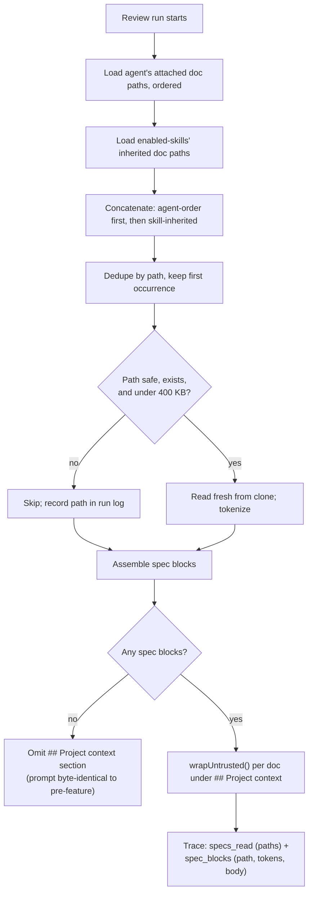

# Project Context

Project Context turns a repo's own markdown (specs, docs, insights) into
**attachable context** for a reviewer agent. A user browses the docs
DevDigest discovered in the repo clone, attaches some to an agent (or to a
skill, so every agent using that skill inherits them), and at run time the
server reads those files fresh from disk and injects them into the existing,
already-hardened `## Project context` prompt slot. The reviewer can then cite
the project's own written rules in its findings — with zero new LLM calls
anywhere in the feature (`specs/SPEC-01-project-context-2026-07-12.md:18-19`).

## What it does

1. **Discovery** — a stateless filesystem walk of the repo clone finds every
   `.md` file that has one of the configured root folder names (`specs`,
   `docs`, `insights` by default) as an exact, case-sensitive path segment at
   any depth (`server/src/modules/context/walk.ts:33-43`).
2. **Browse** — a read-only `/context` page lists the discovered docs with a
   folder-type badge and a markdown preview
   (`client/src/app/context/page.tsx`,
   `client/src/app/context/_components/ContextView/`).
3. **Attach** — an agent-editor **Context** tab
   (`client/src/app/agents/[id]/_components/AgentEditor/_components/ContextTab/ContextTab.tsx`)
   and a skill-editor **"Project context to use"** section
   (`client/src/app/skills/[id]/_components/SkillDetail/_components/ContextTab/ContextTab.tsx`)
   let a user order, toggle, filter, and preview docs, storing only **ordered
   paths** — never doc text (`server/src/db/schema/agents.ts:70-80`,
   `server/src/db/schema/skills.ts:36-46`).
4. **Inject** — at review time the server resolves the agent's attached docs
   plus its enabled skills' inherited docs, dedupes, reads each fresh from the
   clone, and fills the `## Project context` slot
   (`server/src/modules/reviews/run-executor.ts:203-206,386-444`).
5. **Trace** — the run trace records which docs were injected (paths) plus a
   structured per-doc block (path, tokens, full text) so a user can inspect
   exactly what reached the model
   (`server/src/vendor/shared/contracts/trace.ts:47-52,63-69,113`).

## Endpoints

All routes are registered by `server/src/modules/context/routes.ts:21-86` and
mounted via `server/src/modules/index.ts` / `server/src/platform/container.ts`.

| Method | Path | Request | Response | Notes |
|---|---|---|---|---|
| GET | `/repos/:id/context` | — | `ContextList` (`{ docs: ContextDoc[], reason: 'not_cloned' \| null }`) | Fresh, uncached walk every call (`context/routes.ts:25-32`, `context/service.ts:46-68`) |
| POST | `/repos/:id/context/preview` | `{ path: string }` | `ContextPreview` (`{ path, content }`) | On-demand read of one doc; POST avoids URL-encoding repo-relative `/` paths (`context/routes.ts:34-41`, `context/service.ts:70-92`) |
| GET | `/agents/:id/context` | — | `AgentContextLink[]` | Ordered attach set for an agent (`context/routes.ts:43-52`) |
| POST | `/agents/:id/context` | `SetContextBody` (`{ docs: {path, order}[] }`) | `AgentContextLink[]` | Replaces the whole ordered set (`context/routes.ts:54-63`, `context/repository.ts:51-59`) |
| GET | `/skills/:id/context` | — | `SkillContextLink[]` | Ordered attach set for a skill (`context/routes.ts:65-74`) |
| POST | `/skills/:id/context` | `SetContextBody` | `SkillContextLink[]` | Replaces the whole ordered set (`context/routes.ts:76-85`, `context/repository.ts:72-79`) |

**`ContextDoc`** (`server/src/vendor/shared/contracts/platform.ts:254-261`): `path`, `folder_type` (`'specs'|'docs'|'insights'`), `size_bytes`, `tokens` (from `container.tokenizer`), `updated_at?`.

A repo that was never cloned returns `{ docs: [], reason: 'not_cloned' }` rather
than a 500 (`context/service.ts:46-49`).

## Config

`CONTEXT_ROOTS` — comma-separated root folder names, default `specs,docs,insights`
(`server/src/platform/config.ts:41`), surfaced as `AppConfig.contextRoots: string[]`
(`config.ts:66,85`). The walker matches these as exact path segments, at any
depth, not just top-level (`walk.ts:33-43`).

## Storage model

Two paths-only join tables mirror `agent_skills`:

- `agent_context(agent_id, path, order)` — PK `(agent_id, path)`, FK cascade on the agent (`server/src/db/schema/agents.ts:70-80`).
- `skill_context(skill_id, path, order)` — PK `(skill_id, path)`, FK cascade on the skill (`server/src/db/schema/skills.ts:36-46`).
- Migration `server/src/db/migrations/0014_marvelous_butterfly.sql` creates both tables.

Neither table has a `workspace_id` column; scoping is enforced through the
owning agent/skill row (`context/service.ts:29-39,96-134`), the same pattern
used by `agent_skills`.

## Ordering and dedupe

At run time (`server/src/modules/reviews/context-blocks.ts:12-21`,
`run-executor.ts:386-444`):

1. Load the agent's own attached docs, in stored order.
2. Load docs inherited from the agent's **enabled** skills — gated on both
   `skills.enabled` and the per-agent `agent_skills.enabled`
   (`server/src/modules/context/repository.ts:89-108`), ordered by the
   skill's link order on the agent, then the skill's own context order.
3. Concatenate agent-first, then skill-inherited.
4. Dedupe by path, **keeping the first occurrence** — so a doc attached
   directly on the agent always wins its position over the same doc inherited
   from a skill (`context-blocks.ts:12-21`).

## Security model

- **Untrusted by construction.** Every injected doc is repo content authored
  outside DevDigest's trust boundary. Each is wrapped with `wrapUntrusted`
  (delimiter-escaped so a doc can't close its own block) and rendered under
  `## Project context`
  (`reviewer-core/src/prompt.ts:31-34,104-106,127`).
- **`INJECTION_GUARD` names it explicitly.** The guard text appended to every
  system prompt enumerates "attached project-context / spec documents under
  `## Project context`" among the untrusted sources the model must treat as
  data, never instructions (`reviewer-core/src/prompt.ts:16-29`).
- **Safe path resolution.** `resolveInClone(clonePath, rel)` requires
  `resolve(root, rel)` to stay at or under `resolve(root)`, rejecting
  absolute paths and `..` traversal; it is a standalone guard (NOT the
  unguarded `readClone`) shared by discovery, preview, and run-time injection
  (`server/src/platform/fs-guard.ts:13-18`). Attach-time validation applies
  the same check against a virtual root, since agents/skills aren't
  repo-scoped (`context/service.ts:137-151`).
- **400 KB read cap.** Both the preview endpoint and run-time injection reuse
  `MAX_FILE_SIZE` (400 KB, `server/src/modules/repo-intel/constants.ts:43`)
  and skip (rather than error on) oversized files
  (`context/service.ts:79-87`, `run-executor.ts:417-427`).
  There is **no** cap on total injected tokens — the per-doc/total token
  counts shown in the attach UIs are the only guard against an oversized
  prompt (spec Non-functional, `specs/SPEC-01-...md:294-296`).
- **Missing/unsafe docs never fail a run.** A path that no longer resolves,
  no longer exists, or exceeds the size cap is skipped and recorded in the
  run log; the run continues with the remaining docs
  (`run-executor.ts:409-437`).
- **Discovery never follows symlinks** and skips the standard ignored dirs
  (`node_modules`, `.git`, `dist`, `build`, `coverage`, `.next`, `out`,
  `vendor`) even when they contain a matching root folder
  (`walk.ts:19-21,59-66`).
- **Workspace-scoped.** Every context query resolves the owning repo/agent/
  skill through `workspaceId`-scoped repositories before touching the clone
  (`context/service.ts:47,72,97,118`), the same IDOR-safe pattern used
  elsewhere in the server.

## Omit-when-empty

When no doc is attached and none is inherited, `specs` is never passed to
`reviewPullRequest`, so `assemblePrompt` omits the `## Project context`
section entirely — the prompt is byte-identical to the pre-feature shape
(`run-executor.ts:228-232`, `reviewer-core/src/prompt.ts:104-106,127`).

## Run-time injection flow

## Trace visibility

`PromptAssembly.spec_blocks: SpecBlock[] | null` — one `{ path, tokens, body }`
entry per injected doc, mirroring `skill_blocks`
(`server/src/vendor/shared/contracts/trace.ts:47-52,63-69`).
`RunTrace.specs_read: string[]` — the ordered list of injected doc paths,
shown in the trace Configuration section (`trace.ts:113`,
`run-executor.ts:307-308,318`). The client trace viewer renders `spec_blocks`
under a "Project context — attached specs (untrusted)" block the user can
open to read the full injected text
(`client/src/app/repos/[repoId]/pulls/[number]/_components/RunTraceDrawer/_components/TraceBody/TraceBody.tsx`).
A failed/cancelled run's trace records `specs: null, spec_blocks: null,
specs_read: []` (`run-executor.ts:591-598`).

## Non-goals (explicit)

Per `specs/SPEC-01-project-context-2026-07-12.md:43-53`, this feature does
**not** include:

- Edit mode, or the "+"/upload/new-folder toolbar — the `/context` page is a
  **read-only browser** (NG1).
- A coverage-score badge ("78 COVERAGE", "Used by 3 agents") (NG2).
- Chunking, embedding, or a vector index of the docs, or "Indexed: N files ·
  N chunks" stats — docs are injected as raw text (NG3).
- Auto-selection of docs per PR (a relevance/flash selector) — deferred to a
  future lesson (NG4).
- A spec-conformance agent that verifies an implementation against a spec and
  blocks merge — this feature only makes the reviewer *read* attached specs
  (NG5).
- Writing, moving, deleting, or uploading docs from the app — docs are
  sourced only from the existing repo clone on disk (NG6).
- A per-doc or total token cap on injected context — consciously discarded,
  not deferred (spec Non-functional).
- Snapshotting attached context paths into `agent_versions.config_json` —
  replaying an old agent version injects the agent's *current* attachments,
  not the version's (plan "Decided notes & deferred follow-ups",
  `.ai/plans/project-context.md:103`).

## Client data layer

`client/src/lib/hooks/context.ts` — `useContextFiles`, `useReindexContext`
(rescan = invalidate/refetch, no reindex endpoint), `useContextPreview`,
`useAgentContext`/`useSetAgentContext`, `useSkillContext`/`useSetSkillContext`.

## E2E coverage

`e2e/specs/08-project-context.flow.json`, exercised against fixture docs in
`server/fixtures/demo-context-docs/`.

---

Files consulted: `server/src/modules/context/{walk,service,repository,routes}.ts`,
`server/src/platform/{fs-guard,config}.ts`,
`server/src/modules/reviews/{context-blocks,run-executor}.ts`,
`server/src/db/schema/{agents,skills}.ts`,
`server/src/db/migrations/0014_marvelous_butterfly.sql`,
`server/src/vendor/shared/contracts/{platform,trace}.ts`,
`reviewer-core/src/prompt.ts`, `client/src/lib/hooks/context.ts`,
`client/src/app/context/**`, agent/skill editor `ContextTab` components,
`e2e/specs/08-project-context.flow.json`,
`specs/SPEC-01-project-context-2026-07-12.md`, `.ai/plans/project-context.md`.
