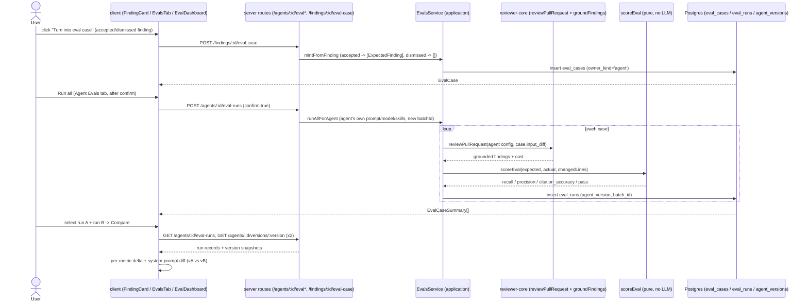

# Course Lesson Features

This doc records what each DevDigest course lesson shipped, so a reader can see
what exists without re-deriving it from the diff. Each lesson gets its own H2
section, newest first.

## L06 — Eval Pipeline (agent-scoped)

**Spec:** `specs/eval-pipeline.md` (SPEC-04) · **Plan:** `.ai/plans/eval-pipeline.md` ·
**Branch:** `feature/eval-pipeline`

### What it does

Agents drift when their system prompt, model, or linked skills change — review
quality moves invisibly. The Eval Pipeline turns real accept/dismiss decisions
into a scored, repeatable regression check **for an agent**, extending the
pre-existing **skill**-scoped eval flow (`GET/POST /skills/:id/evals*`,
`server/src/modules/evals/routes.ts`) rather than replacing it.

- Any accepted or dismissed finding can be minted into an eval case with one
  click.
- Each agent gets its own eval-case set and a "run all" action that replays
  every case through the review engine using **that agent's own**
  `system_prompt` / `provider` / `model` / `strategy` / enabled skills — so two
  runs are only ever comparing the agent, not a different model.
- Every run is scored **purely in code** (`scoreEval`, zero LLM calls).
- Two runs of the same agent can be compared side by side, including a diff of
  the two system-prompt versions they ran under.
- A sidebar **Eval Dashboard** page rolls this up across every agent in the
  workspace.

### Finding → case mapping (mint)

`EvalsService.mintFromFinding` (`server/src/modules/evals/service.ts:159-213`)
resolves the case owner unambiguously via finding → review → `agentId`
(`container.reviewRepo.findingContext`), then:

| Finding decision | `expected_output` | Meaning |
|---|---|---|
| accepted | `[ExpectedFinding]` mapped from the finding (`severity`, `category`, `title`, `file`, `start_line`, `end_line`) | must-find — the agent must reproduce this finding |
| dismissed | `[]` (empty array) | must-not-flag / decoy — the agent must stay silent on this diff |

There is no separate "expectation type" column — must-find vs. must-not-flag
is expressed **only** by whether `expected_output` is non-empty
(`server/src/modules/evals/service.ts:556-558`, proven by
`server/src/modules/evals/score.test.ts:121-129`, AC-3). `input_diff` is the
patch of the **single file the finding is on** (`ctx.pull.id` → `getPrFiles` →
match on `finding.file`), not the whole PR diff
(`server/src/modules/evals/service.ts:185-187`). Re-minting the same finding
returns the existing case instead of duplicating it, via a
`inputMeta.source_finding_id` dedup lookup
(`server/src/modules/evals/service.ts:167-173`, `repository.ts`).

In the UI, `FindingCard`'s "Turn into eval case" button is disabled (with a
tooltip) until the finding is accepted or dismissed —
`disabled={!muted || mintPending}` where `muted = accepted || dismissed`
(`client/src/app/repos/[repoId]/pulls/[number]/_components/FindingCard/FindingCard.tsx:54-56,120-126`).

### Running a set with the agent's own config

`runAgentCase` (`server/src/modules/evals/service.ts:458-514`) calls
`reviewPullRequest` (from `@devdigest/reviewer-core`, reused unmodified) with
the agent's own `systemPrompt`, `model`, `strategy`, an LLM resolved via
`container.llm(agent.provider)`, and enabled linked-skill bodies via
`selectActiveSkillBlocks` over `agentsRepo.linkedSkills` — no PR/repo-intel
enrichment (an eval case is a stored diff, not a live PR). Each case runs
against its own **stored** `input_diff`, unchanged run to run, so two runs of
the same case are comparable across agent versions.

If a case's LLM call throws, the run is recorded as failed
(`pass: false`, all metrics `null`) and the loop continues to the next case
rather than aborting the whole set (`service.ts:497-513`).

Every `eval_runs` row records the agent's integer `version` at run time
(`agentVersion: agent.version`) and a `batchId` shared by every case in one
run-all invocation, so Compare/Dashboard/Trend have a well-defined "one run"
unit (`server/src/db/migrations/0017_nervous_diamondback.sql`,
`server/src/modules/evals/service.ts:636-684`).

### Scoring — zero LLM calls

`scoreEval` (`server/src/modules/evals/score.ts:30`, reused unchanged) and the
review engine's grounding gate (`reviewer-core`'s `groundFindings`, invoked
inside `reviewPullRequest`) compute:

| Metric | Definition |
|---|---|
| `recall` | matched-expected ÷ total-expected (`1` when nothing is expected) |
| `precision` | matched-expected ÷ total-actual (`1` for a clean must-not-flag run, `0` if it produces any finding) |
| `citation_accuracy` | findings surviving the grounding gate ÷ total-actual |

`server/src/modules/evals/score.test.ts` is the deterministic, model-free
fixture suite gating these definitions — see *How to run it* below.

### Compare & prompt-diff experiment

`GET /agents/:id/eval-runs` lists every run of the agent (client:
`useAgentVersionSnapshot` reads `GET /agents/:id/versions/:version` — an
existing agents-module endpoint — for each run's `agent_version`
(`client/src/app/agents/[id]/_components/AgentEditor/_components/EvalsTab/_components/CompareView/useAgentVersionSnapshot.ts`).
`CompareView` renders the per-metric delta (recall / precision /
citation-accuracy / cost) plus a line-based diff of the two runs'
system-prompt versions
(`.../CompareView/helpers.ts:13-49` — a small in-house LCS diff, not the `diff`
package).

### UI surfaces

- **Agent editor → Evals tab**
  (`client/src/app/agents/[id]/_components/AgentEditor/_components/EvalsTab/`):
  per-agent metric cards, case list with pass/fail/never-run status, "Run all"
  gated by a cost estimate + explicit confirm bar
  (`EvalsTab.tsx:59-64,106-130`), per-case single run (no confirm), a Case
  Editor (create/edit via pasted diff), a Trend chart, and the Compare view.
- **Sidebar → Eval Dashboard** (`/eval`,
  `client/src/app/eval/_components/EvalDashboardView/EvalDashboardView.tsx`):
  per-agent rows (recall/precision/citation-accuracy/last-run pass count) +
  recent runs across the workspace, plus workspace-level "Run all agents"
  (sequential, same estimate+confirm gate). The nav entry is a data-only
  addition to the vendored kit
  (`client/src/vendor/ui/nav.ts:36`, under the existing **SKILLS LAB** group).

### Flow



### New backend surface

13 new routes were added to the existing `server/src/modules/evals/routes.ts`
(alongside the unchanged skill-scoped flow); see `server/README.md`'s API map
for the grouped list. A new nullable `eval_runs.agent_version` (int) and
`eval_runs.batch_id` (uuid) column were added via migration
`server/src/db/migrations/0017_nervous_diamondback.sql`. The **new**
`EvalDashboardOverview` Zod contract (per-agent rows + recent runs) was added
to both `server/src/vendor/shared/contracts/eval-ci.ts` and the mirrored
`client/src/vendor/shared/contracts/eval-ci.ts`.

The seed (`server/src/db/seed.ts:686-871`) gives the **Security Reviewer**
agent 8 agent-scoped eval cases: 4 must-find (hardcoded AWS key, SSRF, missing
admin auth, SQL injection) and 4 tempting-but-clean decoys (env-var secret,
allowlisted fetch, auth-middleware-protected admin route, parameterized
query) — chosen so a weak agent has real bait to wrongly flag, keeping
precision non-trivial.

### How to run it

```sh
cd server
pnpm db:migrate     # applies 0017_nervous_diamondback.sql (agent_version, batch_id)
pnpm db:seed        # idempotent; gives Security Reviewer 8 agent eval cases
```

End-to-end experiment (proves a prompt change moves the metrics):

1. Open a PR review, accept a real finding → the FindingCard's "Turn into
   eval case" button enables → click it to mint a must-find case.
2. Open the agent's **Evals** tab → **Run all** → confirm the cost estimate →
   read recall / precision / citation-accuracy.
3. Edit the agent's system prompt (this bumps its `version`) → **Run all**
   again.
4. Select the two runs → **Compare** → see the per-metric deltas and the
   system-prompt diff between the two agent versions.
5. Open the sidebar **Eval Dashboard** (`/eval`) → see every agent's latest
   metrics and recent runs → **Run all agents** → confirm → sequential run
   across every agent.

**Deterministic gate:** `cd server && pnpm verify:l06` runs
`src/modules/evals/score.test.ts` — a model-free Vitest suite asserting the
`recall`/`precision`/`citation_accuracy` definitions and that both expectation
types (must-find / must-not-flag) score correctly. No LLM, no network, no DB.

### Not implemented / not verified

- **Stretch 1** (skill eval in the root `evals/` harness), **Stretch 4**
  (PreToolUse hook), and **Stretch 5** (mutation testing) are explicitly out
  of scope per the spec (`specs/eval-pipeline.md` §Out of scope) — not
  shipped, not documented as shipped.
- A11y claims (keyboard navigation, non-visual trend-chart summary) and some
  "Verify: manual" acceptance criteria (AC-22, AC-25, AC-29, AC-30, AC-34,
  AC-35, AC-38, AC-39, non-functional a11y) are asserted by the spec but were
  not independently re-verified by this doc pass beyond reading the
  implementing code; flagged here rather than asserted as tested.
  > [UNVERIFIED — manual/e2e verification, not re-run for this doc]
