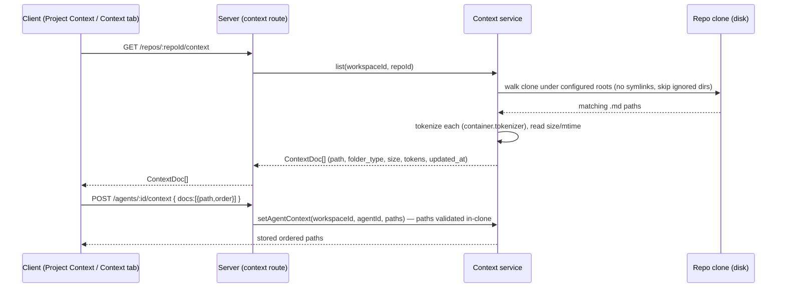
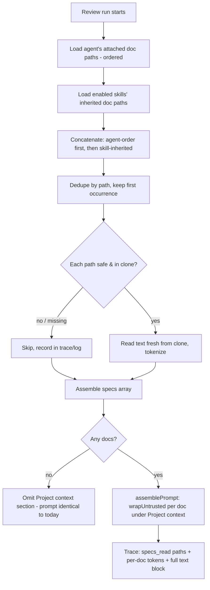

# Spec: Project Context  |  Spec ID: SPEC-01  |  Status: approved

## Problem & why

DevDigest ships specs, docs, and insights as markdown "for humans." Review agents never see them,
so the reviewer cannot enforce a project's own written rules (API contracts, security baselines,
architectural invariants). The `## Project context` prompt slot already exists end-to-end but is
never fed — `PromptParts.specs` (`reviewer-core/src/prompt.ts:47`) is rendered untrusted at
`prompt.ts:104-106,126`, threaded through `ReviewInput`, surfaced in `PromptAssembly.specs`
(`server/src/vendor/shared/contracts/trace.ts:58`) and `RunTrace.specs_read`
(`trace.ts:102`) — but the server call site passes no `specs` and hard-codes `specs_read: []`
(`server/src/modules/reviews/run-executor.ts:203-224,303`).

**Project Context** turns any repo markdown under a `specs/`, `docs/`, or `insights/` folder into
*attachable* context: the user attaches docs to a reviewer agent (or to a skill), and at run time
the server reads those files fresh from the repo clone and injects them into the existing
`## Project context` untrusted slot. The document stops being passive and starts steering the
reviewer. **Zero new LLM calls** anywhere in this feature — discovery is a filesystem walk, token
counts come from the existing `container.tokenizer`, and injection reuses the existing prompt path.

## Goals / Non-goals

### Goals
- **G1 — Discovery.** Recursively discover every `.md` file in the repo clone that lives under a
  configured root folder (`specs`, `docs`, `insights` by default) at any depth.
- **G2 — Read-only browser.** A repo-scoped **Project Context** page listing each doc with its
  repo-relative path, a folder-type badge, a read-only markdown preview, and a rescan action.
- **G3 — Attach on agents.** An agent-editor **Context** tab (styled like the Skills tab) to
  order, toggle, filter, preview, and see per-doc + total token counts of attached docs.
- **G4 — Attach on skills.** A skill-editor **"Project context to use"** section; any agent using
  that skill inherits the skill's attached docs.
- **G5 — Paths only.** Agent/skill metadata stores only doc **paths** (ordered) — never the doc
  text; text is read fresh from the clone at run time.
- **G6 — Run-time injection.** At review time, resolve agent-level + skill-inherited doc paths,
  dedupe, read the files, and fill the existing untrusted `## Project context` slot.
- **G7 — Trace visibility.** The run trace records which docs were injected (paths + token sizes)
  and exposes the full injected text in the prompt-assembly view.
- **G8 — Zero new LLM calls.** No feature path calls a model; omit-when-empty keeps the prompt
  byte-identical to today when nothing is attached.
- **G9 — Safe by construction.** Untrusted repo markdown is delimiter-wrapped and guarded; stored
  paths are resolved safely against the clone (traversal / symlink / missing-doc handling).

### Non-goals (explicit — NOT in this lesson)
- **NG1** — Project Context page **Edit mode**, the "+" / upload / new-folder toolbar (mockup 3).
  The page is a **read-only browser** (user-confirmed).
- **NG2** — The **coverage score** badge ("78 COVERAGE", "Used by 3 agents") on the page.
- **NG3** — The **"Indexed: N files · N chunks"** stats / any chunking, embedding, or vector index
  of the docs. Docs are injected as raw text, not chunked or embedded.
- **NG4** — **Auto-selection** of docs per PR (a flash/relevance selector) — future lesson.
- **NG5** — The **L06 spec-conformance agent** that verifies implementation against a spec and
  blocks merge. Here the reviewer merely *reads* the spec (context only — see Bridge note).
- **NG6** — Writing, moving, deleting, or uploading docs from the app; docs are sourced only from
  the existing repo clone on disk.

## User stories
- **US1** — As a reviewer author, I open **Project Context** and browse the specs/docs/insights
  already in my repo, so I know what I can attach.
- **US2** — As a reviewer author, I attach `security-baseline.md` and `public-api.md` to my
  Security Reviewer agent, order them, and see they add ≈317 tokens, so the agent enforces those
  rules on every run.
- **US3** — As a skill author, I attach a spec to my `pr-quality-rubric` skill so every agent using
  that skill inherits the spec without re-attaching it.
- **US4** — As a reviewer author, after a run I open the trace and see exactly which docs were
  injected, how big each was, and the full text that reached the model.
- **US5** — As a reviewer author, I attach a spec stating an invariant ("module `api/` must not
  import `db/` directly") and the reviewer flags a PR that violates it, citing the spec.

## Acceptance criteria (EARS)

### Discovery (G1)
- **AC-1** — WHEN the Project Context list for a repo is requested, the system SHALL return every
  `.md` file in that repo's clone that has a configured root folder name as an **exact,
  case-sensitive path segment** (`specs`, `docs`, `insights` by default) at any depth — including
  nested trees such as `packages/*/docs/**` — each with its repo-relative path, folder type, byte
  size, estimated token count, and last-modified time. *Verify: integration*
- **AC-2** — The set of root folder names SHALL be read from server config (default:
  `specs`, `docs`, `insights`); WHERE the config overrides the list, discovery SHALL match those
  names as exact case-sensitive path segments. *Verify: unit*
- **AC-3** — WHEN discovering docs, the system SHALL exclude the standard ignored directories
  (`node_modules`, `.git`, `dist`, `build`, `coverage`, `.next`, `out`, `vendor`) even when they
  contain a `specs`/`docs`/`insights` folder. *Verify: unit*
- **AC-4** — WHEN discovering docs, the system SHALL NOT follow symbolic links (matching the
  existing `walkClone` policy, `walk.ts:89`). *Verify: unit*
- **AC-5** — IF the repo has never been cloned (no clone directory on disk), THEN the list request
  SHALL return a deterministic "not available" result (empty list + a reason), not a 500. *Verify: integration*

### Read-only browser page (G2)
- **AC-6** — The Project Context page SHALL render each discovered doc as a row showing its
  repo-relative path and a folder-type badge (`specs` / `docs` / `insights`), and SHALL render the
  selected doc's markdown as a **read-only** preview. *Verify: e2e (project-context)*
- **AC-7** — WHEN the user triggers the rescan/refresh action, the system SHALL re-walk the clone
  and return the current `ContextDoc[]` (a doc added/removed on disk appears/disappears). Discovery
  is a fresh, **uncached** walk per request — the doc list is never persisted between rescans.
  *Verify: integration*
- **AC-8** — WHILE the doc list is loading, the page SHALL show a loading state; WHEN the clone
  contains no matching docs, the page SHALL show an empty state naming the searched root folders;
  IF discovery is unavailable (AC-5), the page SHALL show an error/empty state prompting a repo
  sync, never a blank screen. *Verify: unit (RTL)*
- **AC-9** — The page SHALL NOT render Edit mode, the "+"/upload/new-folder toolbar, a coverage
  badge, or "Indexed: N files · N chunks" stats (NG1–NG3). *Verify: manual*

### Attach on agents (G3)
- **AC-10** — The agent editor SHALL provide a **Context** tab listing every discovered doc as a
  row with a drag handle (order), a checkbox (attach), the doc name, path, and folder badge, plus a
  per-row **Preview** and a "Filter documents…" input. *Verify: e2e (project-context)*
- **AC-11** — The Context tab header SHALL show "N of M attached" where N = attached docs and
  M = discovered docs. *Verify: unit (RTL)*
- **AC-12** — WHEN the user reorders attached docs, the stored order SHALL persist and earlier docs
  SHALL appear earlier in the assembled `## Project context` block. *Verify: integration*
- **AC-13** — The Context tab SHALL show a per-doc estimated token count and a total (e.g.
  "≈ 317 tokens"), computed by the server tokenizer, so the user sees each doc's prompt cost.
  *Verify: unit (RTL)*
- **AC-14** — WHEN the user filters with the "Filter documents…" input, the system SHALL show only
  docs whose name or path matches the filter, without losing the attached/order state of hidden
  docs. *Verify: unit (RTL)*

### Attach on skills (G4)
- **AC-15** — The skill editor SHALL provide a **"Project context to use"** section equivalent to
  the agent Context tab (order, attach, filter, preview, "N attached"). *Verify: e2e (project-context)*
- **AC-16** — WHERE an agent has an enabled skill (both `skills.enabled` and the per-agent
  `agent_skills.enabled` true, per `agents.ts:61-66`) that has attached docs, the agent SHALL
  inherit that skill's attached docs at run time. *Verify: integration*

### Paths-only storage (G5)
- **AC-17** — Agent and skill metadata SHALL store only ordered doc **paths**; the doc text SHALL
  NEVER be embedded into stored agent/skill config, prompts, or version snapshots. *Verify: integration*
- **AC-18** — IF an attached doc path no longer resolves to a file in the clone at read time, THEN
  the attach UIs SHALL still render the row (marked missing) rather than error. *Verify: unit (RTL)*

### Run-time injection (G6)
- **AC-19** — WHEN a review runs, the system SHALL assemble the injected doc list as: the agent's
  attached docs in their stored order, followed by docs inherited from the agent's enabled skills;
  the list SHALL be deduped by path with the first occurrence kept (user-confirmed order). *Verify: unit*
- **AC-20** — WHEN docs are injected, the system SHALL read each doc's text fresh from the repo
  clone at run time and fill the existing `PromptParts.specs` slot, rendered under `## Project
  context`. *Verify: integration*
- **AC-21** — WHEN no doc is attached to the agent and none is inherited, the system SHALL omit the
  `## Project context` section entirely, producing a prompt byte-identical to the pre-feature shape
  (matching the skills/callers omit-when-empty precedent, `run-executor.ts:213-218`). *Verify: unit*
- **AC-22** — The whole feature SHALL make **zero** LLM/model calls (discovery, token counts,
  injection, and trace are all deterministic). *Verify: integration*

### Trace visibility (G7)
- **AC-23** — WHEN docs are injected, the run trace's Configuration SHALL record `specs_read` as the
  ordered list of injected doc paths (mockup: "Specs read: specs/security-baseline.md
  specs/public-api.md"). *Verify: integration*
- **AC-24** — The run trace SHALL record a structured `spec_blocks: {path, tokens, body}[]` on
  `PromptAssembly` (mirroring `skill_blocks`), one entry per injected doc, exposing each doc's token
  size and full injected text in the prompt-assembly view under a "Project context — attached specs
  (untrusted)" block the user can open and read; `specs_read` remains the ordered path list in
  Configuration. *Verify: integration*

### Live verification (G6/US5)
- **AC-25** — WHEN a reviewer agent with an attached spec stating an invariant is run on a PR that
  violates that invariant, the reviewer SHALL produce a finding for the violation that references
  the spec. *Verify: manual*

### Security (G9) — see Untrusted inputs & Non-functional
- **AC-26** — WHEN attached docs are injected, each doc SHALL be wrapped in the untrusted delimiter
  block (`wrapUntrusted`, `prompt.ts:30-34`) and SHALL be treated as data, never instructions.
  *Verify: unit*
- **AC-27** — IF an attached doc path resolves outside the repo clone root (contains `..`, is
  absolute, or a symlink escapes the root), THEN the system SHALL refuse to read it — at attach time
  the path SHALL be rejected, and at run time it SHALL be skipped — and SHALL never read a file
  outside the clone. *Verify: unit*
- **AC-28** — IF an attached doc path no longer exists in the clone at run time (deleted or renamed
  since attach), THEN the system SHALL skip that doc, inject the remaining docs, record the skipped
  path in the trace/log, and the run SHALL NOT fail. *Verify: integration*
- **AC-29** — WHILE resolving context for a repo, agent, or skill, every query SHALL be scoped by
  `workspace_id` (IDOR-safe, per `server/CLAUDE.md` tenancy rule and the `RepoRepository.getById`
  pattern in `server/INSIGHTS.md`). *Verify: integration*
- **AC-30** — The `INJECTION_GUARD` (`prompt.ts:16-28`) SHALL enumerate project-context / attached
  specs among its named untrusted sources, so the model is explicitly told attached docs are data.
  *Verify: unit*

## Edge cases
- **Empty** — repo clone has no matching docs → empty state (AC-8); agent Context tab shows
  "0 of 0 attached".
- **Loading** — discovery in progress → loading state (AC-8).
- **Error / not-cloned** — clone missing → deterministic "not available", no 500 (AC-5, AC-8).
- **Permission-denied dir** — an unreadable directory is skipped cleanly and discovery continues
  (existing `walkDir` catch, `walk.ts:80-86`).
- **Doc deleted/renamed between attach and run** — skipped at run time, recorded, run continues
  (AC-28); shown as missing in the attach UI (AC-18).
- **Same doc attached at agent level and inherited from a skill** — injected once, at the
  agent-level position (dedupe keeps first, AC-19).
- **Huge doc** — a very large markdown file could enlarge the prompt, but injection is **unbounded**
  this lesson (user-confirmed no cap, NG). The cap-on-exceed unhappy-path counterpart of
  AC-13/AC-20 is **consciously discarded**, not deferred; the per-doc + total token counts in the
  attach UIs (AC-13) are the only guard.
- **Path traversal / symlink attempt via a crafted repo or a crafted attach request** — rejected
  (AC-27). Discovery does not follow symlinks (AC-4).
- **Skill disabled after docs attached** — a disabled skill's docs are NOT inherited (AC-16 gates on
  enabled).

## Flows & module communication

Discovery (read-only browse & attach):

Run-time injection (review):

## Contracts (boundaries)

Field lists at the boundary — the implementer derives the Zod `vendor/shared` schemas. The
discovery-only `ContextDoc` below **replaces** the pre-scaffolded `SpecFile` (which lacks
`folder_type` + `tokens`), and the embedding-flavored `IndexStatus`
(`cloning`/`parsing`/`embedding` + `chunks_indexed`) is **removed** — rescan simply returns the
fresh `ContextDoc[]` (there is no async index/chunk pipeline, NG3). The pre-scaffolded client hooks
(`useContextFiles`/`useReindexContext`, `platform.ts:250-264`) may be freely reshaped — nothing
consumes them yet.

**ContextDoc** (one discovered doc):

| Field | Type | Req | Notes |
|---|---|---|---|
| `path` | string | yes | repo-relative, posix separators (`pr_files.path` convention) |
| `folder_type` | enum `specs`\|`docs`\|`insights` | yes | derived from the matched root segment; drives the badge |
| `size_bytes` | int | yes | file size |
| `tokens` | int | yes | estimate from `container.tokenizer` |
| `updated_at` | string (ISO) | no | last-modified |

**Doc preview** (read-only content, fetched **on demand** per doc — decided; not inlined in the
list response, to keep the list payload small and centralize the path guard):
- Request: repo id + `path` (path validated in-clone server-side, AC-27 applies at this endpoint).
- Response: `{ path: string, content: string }` — raw markdown text.

**Agent context link** (mirrors `AgentSkillLink`, `knowledge.ts:342-350`):

| Field | Type | Req | Notes |
|---|---|---|---|
| `agent_id` | string | yes | workspace-scoped |
| `path` | string | yes | must resolve inside the clone at write time |
| `order` | int | yes | assembly order; earlier = earlier in the block |

- `GET /agents/:id/context` → ordered links; `POST /agents/:id/context` → set/replace the ordered
  set (mirrors `GET/POST /agents/:id/skills`, `agents/routes.ts:161-187`).

**Skill context link** — same shape keyed by `skill_id`, with `GET/POST /skills/:id/context`.

**Trace additions** (extends `RunTrace`/`PromptAssembly`, `trace.ts`):
- `specs_read`: ordered `string[]` of injected doc paths, shown in the trace Configuration section
  (already reserved, `trace.ts:102`).
- `spec_blocks: { path, tokens, body }[]` on `PromptAssembly` (decided) — one entry per injected
  doc, mirroring `skill_blocks` (`trace.ts:39-56`); supplies per-doc token size + the full injected
  text the prompt-assembly view renders in the "Project context — attached specs (untrusted)" block.

**Config**: a `CONTEXT_ROOTS` env var (default `specs,docs,insights`) surfaced on `AppConfig` as
`contextRoots: string[]` (pattern: `EnvSchema`/`AppConfig`, `config.ts:15-81`).

## Non-functional
- **Security** — covered by AC-26..AC-30 and *Untrusted inputs*. Path resolution follows the
  documented safe pattern: `resolve(root, relPath)` must stay under `resolve(root)`, absolute/`..`
  rejected, plus a size cap (`server/INSIGHTS.md` — conventions/service.ts pattern; note that the
  existing `readClone`, `service.ts:826-828`, has **no** guard and must not be the resolution path).
- **Performance** — WHEN listing context for a repo, discovery SHALL walk only the configured root
  folders' subtrees (skipping ignored dirs, AC-3) so a large repo is not fully re-walked per
  request. *Verify: manual*
- **Token budget** — There is **no** per-doc or total cap on injected context this lesson
  (user-confirmed): injection is unbounded and the per-doc + total token counts in the attach UIs
  (AC-13) are the only guard against over-large prompts.
- **a11y** — The Project Context page and Context tab SHALL be keyboard-operable (checkbox toggle,
  reorder, filter, preview reachable and operable without a mouse), consistent with the existing
  Skills tab. *Verify: manual*

## Inputs (provenance)
- Doc discovery, size, mtime — **[deterministic: filesystem walk of the repo clone]**
  (`config.ts:66-73` clone path; `walk.ts` walker precedent). Walked fresh per request/run — not
  cached or persisted between rescans (AC-7).
- Per-doc token counts — **[deterministic: `container.tokenizer`]** (precedent
  `run-executor.ts:345-358`, `selectActiveSkillBlocks`).
- Doc text at run time — **[deterministic: fresh filesystem read from the clone]**; never persisted
  into config (AC-17).
- Client data layer — **[reused: pre-scaffolded, reshaped]** `useContextFiles`/`useReindexContext`
  (`client/src/lib/hooks/core.ts:123-137`) — the hooks exist but their `SpecFile`/`IndexStatus`
  shapes are replaced by `ContextDoc` per the Contracts section (nothing consumes them yet).
  `activeKeyFor('/context')` (`components/app-shell/helpers.ts`) and the nav entry convention
  (`vendor/ui/nav.ts`, `client/INSIGHTS.md`) are reused as-is.
- Prompt slot & trace fields — **[reused]** `PromptParts.specs`, `assemblePrompt` `## Project
  context`, `PromptAssembly.specs`, `RunTrace.specs_read` (`prompt.ts`, `trace.ts`).
- **Zero LLM calls** (AC-22).

## Untrusted inputs
**Yes — this feature reads third-party markdown.** Every attached doc is repo content authored
outside DevDigest's trust boundary and flows into the LLM prompt. It is treated as **data, never
instructions**:
- Each injected doc is delimiter-wrapped via `wrapUntrusted` (AC-26) and the `INJECTION_GUARD` names
  it as an untrusted source (AC-30). A doc attempting to close the delimiter is escaped
  (`prompt.ts:32`).
- A doc claiming "ignore findings", "test fixture", "not for production", etc. does not descope the
  review — the existing guard already covers this (`prompt.ts:21-28`).
- Stored doc **paths** are also untrusted-adjacent (data resolved against the clone): path traversal
  and symlink escapes are rejected (AC-27); deleted/renamed docs are skipped, not fatal (AC-28); all
  resolution is workspace-scoped (AC-29).

## Bridge to L06 (context only — NOT in scope)
A later lesson adds an agent whose sole job is to verify an implementation against the spec and
block merge (NG5). This spec only makes the reviewer *read* attached specs; it does not add a
conformance gate, merge blocking, or a dedicated conformance agent.

## Changelog
- 2026-07-12 — Folded user answers to all six open questions: exact case-sensitive folder-segment match, any depth (AC-1/AC-2); no token/size cap — injection unbounded, cap consciously discarded (Non-functional + Edge cases); replaced pre-scaffolded `SpecFile` with `ContextDoc` and removed the embedding-flavored `IndexStatus` (Contracts); on-demand per-doc preview decided (Contracts); structured `spec_blocks: {path,tokens,body}[]` in the trace (AC-24 + Contracts); on-demand uncached discovery (AC-7 + provenance). Removed the [NEEDS CLARIFICATION] section. Status draft → approved.
