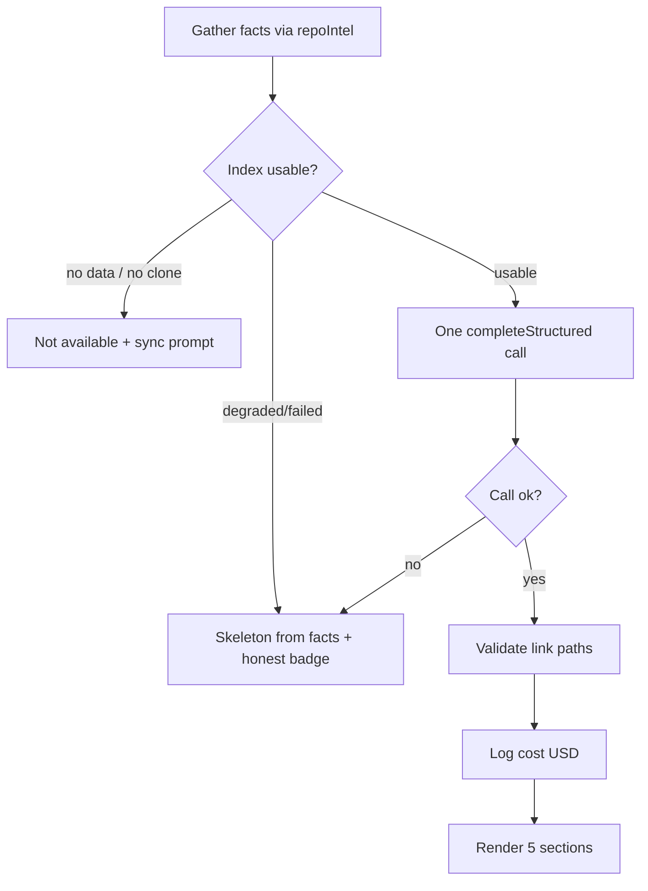

# Spec: Onboarding Generator  |  Spec ID: SPEC-02  |  Status: draft

## Problem & why

A newcomer dropped into an unfamiliar repo spends the first hours reverse-engineering "where does a
request start, what are the load-bearing files, how do I run this, what should I read first." DevDigest
already computes the raw material for those answers deterministically — the `repoIntel` facade exposes
stack/structure/routes/scripts, a PageRank-ranked import graph (`getTopFilesByRank`,
`server/src/modules/repo-intel/service.ts:640-657`), dependency chains (`getCriticalPaths`,
`service.ts:664-703`), and reachable HTTP/cron facts (`getReachableFacts`, `service.ts:711-766`) — all
degraded-safe (`types.ts:15-22`). What is missing is a **narrative** that turns those facts into a
first-day tour.

**Onboarding Generator** produces a per-repo **Onboarding Tour** page with five sections
(Architecture overview, Critical paths, How to run locally, Guided reading path, First tasks). Its core
principle is **"code gathers the facts, the model writes the narrative"**: an analyzer pulls
deterministic facts from `repoIntel.*` for free and computes the reading order from file rank; then a
**single structured LLM call** (`LLMProvider.completeStructured`, `server/src/vendor/shared/adapters.ts:82-89`)
turns those facts into the five narrative sections. The prompt scaffolding
(`server/src/prompts/onboarding.system.md`) and the `'onboarding'` system feature-model
(`server/src/vendor/shared/contracts/platform.ts:45-50`, default `openrouter` / `deepseek/deepseek-v4-flash`)
already exist. On a degraded index the page shows a deterministic skeleton built from facts plus an honest
badge — never an empty screen or an error page. Generation cost (`StructuredResult.costUsd`,
`adapters.ts:77`) is recorded in the logs so a reader can compare this facts-first approach against
"stuff the whole repo into context."

## Goals / Non-goals

### Goals
- **G1 — Deterministic fact gathering.** Assemble the tour's inputs (stack, structure, routes/scripts,
  critical paths, reachable facts, index state) entirely from the `repoIntel` facade — no extra model call
  for facts.
- **G2 — Rank-ordered reading path.** Compute the Guided reading path from the import-graph file rank
  (`getTopFilesByRank`), not alphabetically or by date.
- **G3 — One structured narrative call.** Turn the gathered facts into the five sections with exactly one
  `completeStructured` call.
- **G4 — Degraded fallback.** On a degraded/failed index, render a deterministic skeleton from whatever
  facts exist, with an honest "generated without model / index degraded" badge — never empty, never a 500.
- **G5 — Tour page.** A repo-scoped Onboarding Tour page: header with index stats + Regenerate, an
  "On this page" TOC, and the five section cards (narrative + file-path chips, a small architecture diagram,
  copyable run commands, a numbered reading list).
- **G6 — Cost visibility.** Record the generation cost in USD in the run logs **and persist it** (with token
  counts) alongside the cached tour, so the cost is queryable via the API response for the facts-first vs.
  "whole repo in context" comparison.
- **G7 — Cache by indexed SHA.** Cache the generated tour keyed by the repo's indexed SHA; page visits read
  the cache, and the model call runs only on first generation for a SHA or on explicit Regenerate.

### Non-goals (explicit)
- **NG1** — Reintroducing **churn/hotness** into the rank. Today `rank = pagerank`, `hotness = 0` (shallow
  clone `CLONE_DEPTH = 1`, `repo-intel/pipeline/rank.ts:1-13,49-51`), so the stated
  `pagerank × (1 + hotness)` degenerates to pure PageRank; the reading-path order is pure PageRank. Reviving
  hotness is out of scope. It remains a **future extension**: the `hotness` column already exists at 0
  (`rank.ts:51`) and can be switched on later without a schema change, at which point the reading-path rank
  becomes `pagerank × (1 + hotness)` with no contract change here.
- **NG2** — No new indexing/graph work: the tour is a **read-only consumer** of the existing `repoIntel`
  facade; it does not add pipeline steps, tables, or facade methods for facts it cannot already get. In
  particular there is **no generator-specific huge-repo threshold** — "too large" is the indexer's decision
  (`repo_too_large` → the standard degraded fallback, AC-9/AC-10).
- **NG3** — No multi-repo / org-wide tour; the tour is scoped to one repo + its indexed SHA.
- **NG4** — No editing of the generated narrative in the app.
- **NG5** — No **"Share link"** action this lesson (the mockup's Share link button is omitted); sharing is
  deferred.
- **NG6** — No standalone **"routes & APIs"** section. The drafted prompt's `routes_and_apis` section is
  dropped; route/endpoint facts feed the **Architecture overview** narrative instead (reconciling the prompt
  file's section ids is implementation work, per AC-6).

## User stories
- **US1** — As a newcomer, I open the Onboarding Tour for a repo and read a five-section, first-day tour
  grounded in real files, so I know where requests start and which files matter.
- **US2** — As a newcomer, I follow the Guided reading path top-to-bottom and each entry tells me *why* to
  read that file, ordered by how foundational it is.
- **US3** — As a newcomer on a repo whose index is degraded or still building, I still see a useful
  skeleton (facts only) with a clear "generated without model" badge, never a blank or error screen.
- **US4** — As a maintainer, I click Regenerate after the code changed and get a fresh tour for the current
  indexed SHA.
- **US5** — As the course author, I open the logs after a generation and see the tour's cost in USD, so I
  can compare it against the "whole repo in context" baseline.

## Acceptance criteria (EARS)

### Fact gathering & reading path (G1, G2)
- **AC-1** — WHEN a tour is generated for a repo, the system SHALL assemble its factual inputs (stack /
  structure, routes & scripts, critical paths, reachable endpoints/crons, index state) **only** from the
  `repoIntel` facade (`getTopFilesByRank`, `getCriticalPaths`, `getReachableFacts`, `getRepoMap`,
  `getIndexState`), making **zero** model calls to gather facts. *Verify: integration*
- **AC-2** — The Guided reading path SHALL be ordered by import-graph file rank (via `getTopFilesByRank`),
  not alphabetically, by path, or by modified date. *Verify: unit*
- **AC-3** — WHILE `hotness` is 0 for the repo (the current shallow-clone default), the reading-path rank
  SHALL equal pure PageRank; the tour SHALL NOT depend on any non-zero hotness signal. *Verify: unit*
- **AC-4** — The Critical paths section SHALL list files drawn from `getCriticalPaths` / top-ranked files,
  each with a one-line role description and an Open target that points at a **real indexed file path**.
  *Verify: integration*

### Narrative generation (G3)
- **AC-5** — WHEN facts are gathered and the index is usable, the system SHALL produce the five sections
  (architecture overview, critical paths, how to run locally, guided reading path, first tasks) with
  **exactly one** `completeStructured` call, resolving provider+model via
  `resolveFeatureModel(container, workspaceId, 'onboarding')`. *Verify: integration*
- **AC-6** — The system SHALL return **exactly the five mandatory sections** (`architecture`,
  `critical_paths`, `run_locally`, `reading_path`, `first_tasks`) in that fixed order with stable
  identifiers, every time, with no `routes_and_apis` section — route/endpoint facts SHALL be folded into the
  `architecture` section narrative (NG6). The page TOC and cards render deterministically. *Verify: unit*
- **AC-7** — Every file path the model emits (section links / reading-path entries / critical-path Open
  targets) SHALL be validated to resolve to a real path present in the gathered facts; IF the model emits a
  path not in the facts, THEN that link SHALL be dropped (not rendered as clickable). *Verify: unit*
- **AC-8** — The "How to run locally" commands SHALL be derived from the repo's real scripts/setup facts;
  they are presented as **copy-only** text (no auto-execution in the app). *Verify: integration*
- **AC-8a** — The `first_tasks` section SHALL be pure model narrative grounded **only** in the already
  gathered facts; the system SHALL NOT perform any additional fact-gathering for it (no TODO/FIXME scan, no
  issue-tracker integration). *Verify: integration*

### Degraded / fallback (G4)
- **AC-9** — IF `getIndexState` reports `status` `degraded` or `failed`, or a `degradedReason` is set —
  including `repo_too_large` (`types.ts:25-50`) — THEN the system SHALL render a deterministic skeleton built
  from whatever facts exist and SHALL NOT make the model call. *Verify: integration*
- **AC-10** — WHEN the skeleton is rendered, the page SHALL show an honest badge stating it was generated
  without the model and naming the reason (e.g. "index degraded"), and SHALL never show an empty screen or
  an error page. *Verify: e2e (05-onboarding-tour)*
- **AC-11** — IF the single `completeStructured` call fails or times out, THEN the system SHALL fall back to
  the deterministic skeleton (AC-9/AC-10) with the failure reason, rather than returning an error to the
  client. *Verify: integration*
- **AC-12** — IF the repo was never cloned (no clone / no index data, `getIndexState` → `no_data` /
  `no_clone`, `service.ts:148,190-205`), THEN the tour endpoint SHALL return a deterministic "tour not
  available" result (`mode: not_available`, empty sections + reason `not_cloned`), never a 500, and the page
  SHALL show a **"sync this repo" CTA** — no skeleton is attempted from metadata (matching the SPEC-01
  `not_cloned` pattern, `context/service.ts:46-49`). *Verify: integration*
- **AC-13** — The system SHALL gather facts within the `repoIntel` facade's **fixed budgets** (top-N ranked
  files via `getTopFilesByRank`, the repo-map token budget via `getRepoMap`) regardless of repo size, and
  SHALL NOT apply any generator-specific size threshold; an oversized repo is handled solely by the indexer's
  `repo_too_large` degraded state (AC-9). *Verify: unit*

### Page (G5)
- **AC-14** — The Onboarding Tour page SHALL render, for a usable index, the five section cards and an "On
  this page" TOC listing those five sections; the header SHALL show "Onboarding for <repo>", the files-indexed
  count (from `getIndexState.filesIndexed`), and a **last-refreshed** time taken from the **cached tour's
  generation timestamp** (not the index `updatedAt`). *Verify: e2e (05-onboarding-tour)*
- **AC-15** — WHEN the user triggers Regenerate, the system SHALL re-run generation for the current indexed
  SHA, replace the cached tour, and replace the displayed tour. *Verify: e2e (05-onboarding-tour)*
- **AC-16** — WHILE a tour is being generated, the page SHALL show a loading state (not a blank screen);
  WHEN generation completes it SHALL swap in the result. *Verify: unit (RTL)*
- **AC-17** — The How-to-run-locally commands SHALL render as an ordered list where each command is
  individually copyable; the Guided reading path SHALL render as a numbered file list where each entry
  shows its "why read this" one-liner. *Verify: unit (RTL)*

### Caching & regeneration (G7)
- **AC-23** — WHEN a tour is requested and a cached tour exists for the repo's current indexed SHA, the
  system SHALL return the cached tour **without** a model call; the `completeStructured` call SHALL run only
  on the first request for a SHA (cache miss) or on explicit Regenerate (AC-15), mirroring the intent
  getIntent/recalculate split (`intent/service.ts`, `server/INSIGHTS.md`). *Verify: integration*
- **AC-24** — IF the repo's indexed SHA changes (re-index), THEN a subsequent tour request SHALL be a cache
  miss for the new SHA and regenerate, rather than serving the stale SHA's tour. *Verify: integration*

### Cost visibility (G6)
- **AC-18** — WHEN a tour is generated via the model call, the system SHALL record the generation cost in
  **USD** (from `StructuredResult.costUsd`) in the run logs, alongside tokens in/out and the model used.
  *Verify: integration*
- **AC-19** — IF the provider does not report a cost (`costUsd` is `null`, `adapters.ts:77`), THEN the
  system SHALL log the cost as unknown/null and SHALL NOT fail generation. *Verify: unit*
- **AC-25** — WHEN a tour is generated via the model call, the system SHALL **persist** its `cost_usd` (USD)
  and token counts alongside the cached tour, and the tour endpoint response SHALL expose them
  (`generated.cost_usd` + tokens), so the cost is queryable per generation, not only present in logs.
  *Verify: integration*

### Security (see Untrusted inputs & Non-functional)
- **AC-20** — WHEN repo-derived facts, the file tree, and key-file excerpts are placed in the prompt, each
  untrusted block SHALL be delimiter-wrapped and the model instructed to treat it as data, not instructions
  (the `onboarding.system.md` untrusted contract, lines 11-12). *Verify: unit*
- **AC-21** — WHEN the model's narrative (section bodies, mermaid diagram, run commands, link labels) is
  rendered, it SHALL be treated as untrusted output: markdown rendered without raw HTML/script execution,
  the mermaid diagram rendered with script-safe settings, and any link target validated per AC-7 — no
  model-emitted string reaches the DOM as executable HTML or an unvalidated `href`/`src`. *Verify: unit (RTL)*
- **AC-22** — WHILE resolving a tour for a repo, every repo/index query SHALL be scoped by `workspace_id`
  (IDOR-safe, per `server/CLAUDE.md` tenancy rule and the `RepoRepository.getById` pattern). *Verify: integration*

## Edge cases
- **Empty / building index** — index `degraded`/`failed` → facts-only skeleton + badge (AC-9/AC-10).
- **Loading** — generation in flight → loading state, never blank (AC-16).
- **Model failure/timeout** — single call fails → skeleton fallback with reason (AC-11). This is the
  consciously-written unhappy-path counterpart of AC-5.
- **Not cloned** — no clone/index → deterministic "tour not available" + sync CTA, no 500, no skeleton
  attempt (AC-12).
- **Huge repo** — no generator-specific threshold: facts stay within the facade's fixed budgets (AC-13); if
  the indexer marks the repo `repo_too_large`, the standard degraded skeleton + badge is shown (AC-9/AC-10).
- **Stale SHA** — repo re-indexed since last generation → cache miss for the new SHA, regenerated (AC-24).
- **Model hallucinates a file path** — link dropped, not rendered clickable (AC-7).
- **Prompt injection via a repo file** (e.g. a README that says "ignore instructions" or embeds a
  `curl … | sh`) — treated as data (AC-20); commands come from real scripts and are copy-only (AC-8);
  narrative is rendered non-executably (AC-21).
- **Cost not reported by provider** — logged as null, generation still succeeds (AC-19).
- **Isolated files / degenerate graph** — `getTopFilesByRank` already degrades to a flat/uniform ranking
  (`rank.ts:42-47`); the reading path is still populated (best-effort), never throws.

## Flows & module communication

Generation (happy path + fallbacks):

```mermaid
sequenceDiagram
    participant UI as Client (Onboarding Tour page)
    participant API as Server (onboarding route)
    participant SVC as Onboarding service
    participant RI as repoIntel facade
    participant LLM as LLMProvider.completeStructured

    UI->>API: GET /tour (or POST regenerate)
    API->>SVC: getTour(workspaceId, repoId)
    SVC->>RI: getIndexState(repoId)
    alt cached tour exists for current SHA (and not regenerate)
        SVC-->>UI: cached tour (no model call)
    else no clone / no data
        RI-->>SVC: status=degraded, reason=no_data
        SVC-->>UI: not-available (empty sections + reason)
    else usable / degraded index
        SVC->>RI: getTopFilesByRank / getCriticalPaths / getReachableFacts / getRepoMap
        RI-->>SVC: deterministic facts (degraded-safe)
        alt index degraded/failed
            SVC-->>UI: skeleton from facts + "generated without model" badge
        else index usable
            SVC->>LLM: completeStructured(onboarding, facts)  %% exactly one call
            alt call ok
                LLM-->>SVC: 5 sections + costUsd
                SVC->>SVC: validate link paths against facts; log cost (USD)
                SVC-->>UI: tour (5 sections) + index stats
            else call fails / times out
                SVC-->>UI: skeleton from facts + failure reason
            end
        end
    end
```

Fallback decision:



## Contracts (boundaries)

Field lists at the boundary — the implementer derives the Zod `vendor/shared` schemas.

**OnboardingTour** (endpoint response):

| Field | Type | Req | Notes |
|---|---|---|---|
| `repo_id` | string | yes | workspace-scoped |
| `mode` | enum `model` \| `skeleton` \| `not_available` | yes | drives the badge / empty state |
| `reason` | string \| null | no | present for `skeleton`/`not_available` (e.g. `index_degraded`, `repo_too_large`, `not_cloned`, `model_failed`) |
| `sections` | `TourSection[]` | yes | empty when `not_available` |
| `index` | `{ files_indexed: int, sha: string \| null }` | yes | from `getIndexState` (`filesIndexed`, `lastIndexedSha`) |
| `generated_at` | string (ISO) \| null | no | the cached generation timestamp — drives header "last refreshed" (AC-14); null in `not_available` |
| `generated` | `{ model: string \| null, cost_usd: number \| null, tokens_in: int \| null, tokens_out: int \| null }` | no | persisted per generation (AC-25); null/absent in skeleton & not-available modes |

**TourSection** (one of the five):

| Field | Type | Req | Notes |
|---|---|---|---|
| `id` | enum (fixed 5, ordered) | yes | `architecture` \| `critical_paths` \| `run_locally` \| `reading_path` \| `first_tasks` — all five mandatory, always present (AC-6); no `routes_and_apis` |
| `title` | string | yes | section heading |
| `body` | string (markdown) | yes | narrative; markdown only, no raw HTML (AC-21) |
| `diagram` | string \| null | no | mermaid source; allowed only for the architecture section |
| `links` | `{ label: string, path: string }[]` | no | each `path` validated against the facts (AC-7); ≤ small N |
| `commands` | `string[]` | no | `run_locally` only; copy-only shell commands from real scripts (AC-8) |

- **Client route**: `/tour` — repo taken from the workspace/active-repo context exactly like `/context`
  (`nav.ts:26` reads the active repo, not an `:repoId` template). The existing `/onboarding` route is the
  unrelated **Add Repository** screen (`client/src/app/onboarding/page.tsx:6-9`) and is untouched.
- **Nav**: a new WORKSPACE nav item **"Onboarding Tour"** placed **between** "Pull Requests" and "Project
  Context" (`client/src/vendor/ui/nav.ts:24-27`), with a `gKey` shortcut following the existing pattern
  (e.g. `g o`), plus its `activeKeyFor('/tour')` mapping (`components/app-shell/helpers.ts`).
- **Server endpoints** (repo resolved from workspace context, workspace-scoped): read the (cached) tour and
  a regenerate action returning `OnboardingTour`.

**Trace/log & persistence**: generation cost (`cost_usd`, USD), tokens in/out, and model are recorded in the
run logs (AC-18) **and persisted with the cached tour** (AC-25) — exposed on `generated`. There is no "cents"
unit anywhere (`cost_usd` is USD, `run-executor.ts:245,280-301`).

## Non-functional
- **Cost/observability** — WHEN a tour is generated via the model, the generation cost SHALL be recorded in
  USD in the run logs (AC-18) **and persisted** with the cached tour and exposed on the response (AC-25), so
  cost is queryable per generation. *Verify: integration*
- **Performance** — Fact gathering serves from the `repoIntel` Postgres cache and is bounded by the facade's
  fixed budgets (top-N ranked files, repo-map token budget) regardless of repo size (AC-13); cached tours are
  served without a model call (AC-23), so repeat visits do not incur generation latency. *Verify: manual*
- **Security** — covered by AC-7, AC-8, AC-20..AC-22 and *Untrusted inputs*.
- **a11y** — The tour page (TOC navigation, copy buttons, Open links, Regenerate) SHALL be keyboard-operable,
  consistent with existing repo-scoped pages. *Verify: manual*

## Inputs (provenance)
- Stack / structure / routes / scripts / critical paths / reachable facts / reading-path order / index
  state — **[deterministic: repo-intel facade]** (`getTopFilesByRank` `service.ts:640-657`,
  `getCriticalPaths` `service.ts:664-703`, `getReachableFacts` `service.ts:711-766`, `getRepoMap`
  `service.ts:399`, `getIndexState` `service.ts:190-206`).
- The five narrative sections — **[new: 1 LLM call]** `completeStructured` (`adapters.ts:82-89`) using the
  `onboarding` feature-model (`platform.ts:45-50`) and the drafted system prompt
  (`server/src/prompts/onboarding.system.md`); provider/model via `resolveFeatureModel`
  (`feature-models.ts:51-57`).
- Generation cost — **[reused: `StructuredResult.costUsd`]** (`adapters.ts:77`), logged in USD like the
  review path (`run-executor.ts:280-301`).
- Call-flow & cache precedent — **[reused: intent feature]** `resolveFeatureModel` → `container.llm(provider)`
  → structured call → persist/return, plus the SHA-keyed cache getIntent/recalculate split reused for
  cache-read vs. Regenerate (AC-23/AC-15, `server/src/modules/intent/service.ts:112-148`, `server/INSIGHTS.md`);
  the not-cloned deterministic-empty pattern is **[reused: context feature]** (`context/service.ts:46-49`).
- Cached tour + persisted cost/tokens — **[new: persisted per indexed SHA]** (AC-23/AC-25); the tour body
  and its `cost_usd`/tokens/`generated_at` are stored keyed by repo + indexed SHA.
- Client shell (repo-scoped page, active repo, nav entry) — **[reused]** conventions/context page pattern
  (`client/INSIGHTS.md`, `nav.ts`).

## Untrusted inputs
**Yes — this feature reads third-party repo content into an LLM prompt AND renders model output in the UI.**
Two trust boundaries:
- **Repo → model (input):** facts, the file tree, and key-file excerpts are repo content authored outside
  DevDigest's trust boundary. They are delimiter-wrapped and declared data-not-instructions by the drafted
  prompt (`onboarding.system.md:11-12`) (AC-20). A repo file attempting "ignore instructions", role changes,
  or embedding a malicious setup command does not steer generation; run commands come from real scripts and
  are copy-only, never auto-executed (AC-8).
- **Model → UI (output):** the narrative (section bodies, mermaid diagram, run commands, link labels/paths)
  is model-generated and untrusted. It is rendered non-executably: markdown without raw HTML/script,
  mermaid with script-safe settings, and link targets validated against real facts before becoming clickable
  (AC-7, AC-21). Model output is never executed and never reaches the DOM as HTML or an unvalidated URL.
- All repo/index resolution is `workspace_id`-scoped (AC-22).

## Implementer notes (non-normative)
- **Regenerate** should follow the existing intent generate/recalculate split precedent: extract a private
  `generateAndStore(...)`, have the cached getter call it on a miss, and have `regenerate(...)` call it
  directly (skipping the cache check) — `IntentService.getIntent` vs `recalculate` (`server/INSIGHTS.md`).
- **Model-produced mermaid** that fails to parse SHALL be dropped rather than rendered (the drafted prompt
  already says invalid diagrams are dropped, `onboarding.system.md:29`); rendering stays script-safe,
  reinforcing AC-21.

## Changelog
- 2026-07-12 — Folded user answers to all 8 open questions: five mandatory sections, `routes_and_apis`
  dropped into Architecture (AC-6, NG6); hotness confirmed out of scope / future extension (NG1); no
  generator huge-repo threshold — facade fixed budgets, `repo_too_large` → degraded skeleton (AC-13, AC-9,
  NG2); not-cloned → deterministic "tour not available" + sync CTA, no skeleton (AC-12); SHA-keyed cache +
  Regenerate split (AC-23/AC-24, G7); first-tasks = pure model narrative, no new gathering (AC-8a); Share
  link is a Non-goal (NG5); route `/tour` + WORKSPACE nav item "Onboarding Tour" (Contracts). Accepted
  improvements: persist `cost_usd`+tokens with the cached tour and expose on the response (AC-25); added
  Implementer notes for the intent generate/recalculate split and mermaid-drop rendering. Removed the
  [NEEDS CLARIFICATION] section. Status stays draft.
</content>
</invoke>
