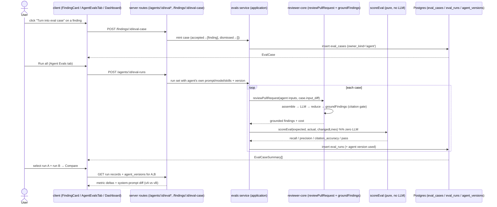

# Spec: Eval Pipeline  |  Spec ID: SPEC-04  |  Status: approved

> Filename deviation: the SDD convention is `SPEC-NN-<slug>-<date>.md`, but the L06 homework
> checklist requires the literal path `specs/eval-pipeline.md`, so this spec keeps that filename
> while retaining the `SPEC-04` identity in the header and the index.

## Problem & why

DevDigest agents drift: change an agent's system prompt, model, or linked skills and the review
quality moves — usually invisibly. There is no regression net that turns real accept/dismiss
decisions into a scored, repeatable check. Lesson L06 builds that net **for the product itself**
(the lab already did it for the harness): mint eval cases from real findings, run an agent over a
fixed case set, and read recall / precision / citation-accuracy back as numbers so a prompt change
is provably better or worse.

Most of the backend already exists but is **skill-scoped**: Zod contracts
(`server/src/vendor/shared/contracts/eval-ci.ts:20`, `:38`, `:53`, `:75`, `:99`, `:110`), the
`eval_cases` / `eval_runs` schema (`server/src/db/schema/eval.ts:7`, `:22`), the pure scorer
(`server/src/modules/evals/score.ts:30`), the grounding gate reused via the review engine
(`reviewer-core/src/grounding.ts:52`, `reviewer-core/src/review/run.ts:204`), and a real-LLM run
loop (`server/src/modules/evals/service.ts:82`) exposed only under `/skills/:id/evals*`
(`server/src/modules/evals/routes.ts:27`). The **new** work is to make the pipeline agent-scoped,
mint cases from findings, add the missing UI, and prove a prompt change moves the metrics.

## Goals / Non-goals

### Goals
- Turn any real finding into an eval case with one click (accepted → "must-find", dismissed →
  "must-not-flag" decoy).
- Give each agent an eval-case set and a run-all-cases action that uses the agent's **own**
  system prompt, model, and linked skills (so runs of different agent versions are comparable).
- Compute recall / precision / citation-accuracy per run **purely in code, zero LLM calls**.
- Surface it in the UI: an Evals tab in the Agent editor, and an Eval Dashboard page in the sidebar.
- Compare two runs side by side, including a system-prompt diff between the two agent versions.
- Prove the experiment: changing a system prompt visibly moves recall/precision between two runs.
- Ship `pnpm verify:l06` as a deterministic, model-free test that gates the scorer.

### Non-goals (explicitly NOT this spec)
- **No change to `reviewer-core`** — it is reused as-is (`reviewPullRequest`, `groundFindings`) and
  MUST stay pure (no DB/HTTP/fs, per `reviewer-core/CLAUDE.md`).
- **No new scoring semantics** — `scoreEval` (`server/src/modules/evals/score.ts:30`) is reused
  unchanged; this spec does not redefine recall/precision/citation-accuracy.
- **No re-implementation** of the existing skill-scoped eval flow, Zod contracts, or DB schema.
- Stretch 1 (skill eval in the root `evals/` harness), Stretch 4 (PreToolUse hook), and Stretch 5
  (mutation testing) — see *Out of scope*.

## User stories
- **US-1** As a reviewer, I click "Turn into eval case" on a finding I accepted so the agent is
  later checked for still catching it.
- **US-2** As a reviewer, I click it on a finding I dismissed so the agent is checked for **not**
  re-flagging that noise.
- **US-3** As an agent author, I open the agent's Evals tab to see every case and its last result.
- **US-4** As an agent author, I run the whole case set for the agent and read recall / precision /
  citation-accuracy for that run.
- **US-5** As an agent author, I change the system prompt, run again, and compare the two runs side
  by side (metrics + prompt diff) to see whether I helped or hurt the agent.
- **US-6** As a team lead, I open the Eval Dashboard to see all agents' latest metrics and the most
  recent runs across the workspace.
- **US-7** (Stretch 2) As an agent author, I hand-author a case from a pasted diff.
- **US-8** (Stretch 3) As an agent author, I watch the metric trend across all of the agent's runs.

## Acceptance criteria (EARS)

### Minting a case from a finding (US-1, US-2)
- **AC-1** — WHEN the user activates "Turn into eval case" on a finding whose decision is
  **accepted**, the system SHALL create an eval case with `owner_kind = 'agent'`, `owner_id` = the
  agent that produced the finding (resolved unambiguously through the finding → review → `agentId`
  chain — each finding belongs to exactly one review, which belongs to exactly one agent), and a
  non-empty `expected_output` holding exactly one `ExpectedFinding` mapped from that finding (see
  *Contracts → Finding → case mapping*). Verify: integration
- **AC-2** — WHEN the user activates it on a finding whose decision is **dismissed**, the system
  SHALL create an eval case with `owner_kind = 'agent'` and an **empty** `expected_output` array
  (the "must-not-flag" / decoy case). Verify: integration
- **AC-3** — The system SHALL expose "must-find" and "must-not-flag" only as `expected_output`
  cardinality — a non-empty `ExpectedFinding[]` means must-find, `[]` means must-not-flag; there is
  no separate expectation-type column. Verify: unit
- **AC-4** — WHEN a case is minted from a finding, the system SHALL populate the case `input_diff`
  with the patch of the **single file the finding is on** (that finding's file-level diff) — not the
  whole PR diff and not just the surrounding hunk — so a subsequent run can reproduce (or fail to
  reproduce) the finding while still seeing the surrounding file context. Verify: integration
- **AC-5** — IF a case has already been minted from the same finding, THEN the system SHALL not
  create a duplicate and SHALL surface the existing case instead of erroring. Verify: integration
- **AC-40** — WHILE a finding is neither accepted nor dismissed (undecided), the UI SHALL render the
  "Turn into eval case" control as **disabled** with an explanatory tooltip (e.g. "Accept or dismiss
  this finding first"), and SHALL enable it only once the finding's decision is accepted or dismissed.
  Verify: e2e (agent-evals)

### Agent case set & runs (US-3, US-4)
- **AC-6** — WHEN the Agent editor's Evals tab is opened, the system SHALL return every eval case
  with `owner_kind = 'agent'` and `owner_id = :id` as `EvalCaseSummary[]`, each carrying its
  latest-run summary (or `null` when never run). Verify: integration
- **AC-7** — WHEN `POST /agents/:id/eval-runs` is received, the system SHALL run every case in the
  agent's set and persist one `eval_runs` row per case. Verify: integration
- **AC-8** — WHEN an agent case set is run, the review of each case SHALL use the agent's **own**
  `system_prompt`, `provider`, `model`, `strategy`, and its enabled linked skills' bodies — not the
  hardcoded skill-eval defaults (`server/src/modules/evals/service.ts:27`, `:92`). Verify: integration
- **AC-9** — The system SHALL run each case against the case's **stored** `input_diff` unchanged, so
  two runs of the same case are comparable across agent versions. Verify: integration
- **AC-10** — WHEN `POST /agents/:id/evals/:caseId/run` is received, the system SHALL run that one
  case and return its updated `EvalCaseSummary`. Verify: integration
- **AC-11** — WHILE an agent run-all is in progress, the UI SHALL show a non-idle running indicator
  and disable a second concurrent run-all for the same agent. Verify: e2e (agent-evals)
- **AC-12** — IF an agent has zero eval cases, THEN a run request SHALL be a no-op that returns an
  empty result with an empty-state message, not an error. Verify: integration
- **AC-13** — IF the LLM call for one case fails during run-all, THEN the system SHALL record that
  case's run as failed (`pass = false`, metrics null) and continue the remaining cases rather than
  aborting the whole set. Verify: integration
- **AC-41** — WHEN a run-all action is requested — either the agent-level `POST /agents/:id/eval-runs`
  or the workspace-level "Run all agents" — the system SHALL first return an **estimated cost** for
  the set (derived from case count × the agent's own provider/model, per AC-8) and SHALL require an
  explicit user confirmation before any LLM call is made; without confirmation no run is executed.
  Verify: integration
- **AC-42** — WHEN a single case is run (`POST /agents/:id/evals/:caseId/run`), the system SHALL
  execute it directly without a cost-estimate or confirmation step. Verify: integration
- **AC-44** — WHEN an `eval_runs` row is persisted, the system SHALL record the integer agent
  `version` the run executed under (the new nullable `eval_runs.agent_version` column), so a later
  compare can diff the exact system-prompt version each run used. Verify: integration

### Scoring — purely in code (Core hard criteria)
- **AC-14** — The system SHALL compute each run's metrics with **zero LLM calls**, reusing the pure
  `scoreEval` (`server/src/modules/evals/score.ts:30`) and the grounding gate applied inside
  `reviewPullRequest` (`reviewer-core/src/review/run.ts:204`). Verify: unit (verify:l06)
- **AC-15** — The system SHALL define `recall` as matched-expected ÷ total-expected (1 when no
  findings are expected). Verify: unit
- **AC-16** — The system SHALL define `precision` as matched-expected ÷ total-actual (1 when a
  must-not-flag case produces no findings, 0 when it produces any). Verify: unit
- **AC-17** — The system SHALL define `citation_accuracy` as (findings surviving the grounding gate)
  ÷ total-actual. Verify: unit
- **AC-18** — The seed (`server/src/db/seed.ts`, which today seeds only skill-scoped cases at
  `:547`) SHALL seed one demo agent — **Security Reviewer** — with **at least 8 agent-scoped eval
  cases** covering both expectation types: several must-find cases (non-empty `expected_output`) and
  several must-not-flag decoys (empty `expected_output`). Each decoy's `input_diff` SHALL contain
  tempting-but-clean code (something a weak agent would wrongly flag), so precision is not trivially
  1. This guarantees ≥8 for the demo agent independently of user-minted cases, and user minting
  (AC-1/AC-2) remains available on top. Verify: integration
- **AC-19** — Both expectation types SHALL score correctly: a must-find case reflects recall from
  the matched finding, and a must-not-flag case reflects precision from re-flagged noise.
  Verify: unit (verify:l06)
- **AC-20** — A `verify:l06` script SHALL live in `server/package.json` (mirroring `verify:l03` at
  `server/package.json:12`) and be run from `server/`. It SHALL run a deterministic, model-free
  Vitest test over the pure `scoreEval` (`server/src/modules/evals/score.ts:30`) with fixtures that
  asserts AC-14 (zero LLM calls), AC-15/16/17 (the recall / precision / citation_accuracy
  definitions), and AC-19 (both expectation types score correctly), and SHALL exit non-zero if any
  regress. Verify: unit

### Evals tab in the Agent editor (US-3, US-5)
- **AC-21** — WHERE the Agent editor is open, the system SHALL present an "Evals" tab (added to the
  existing Config / Skills / Context tab set, `client/src/app/agents/[id]/_components/AgentEditor/constants.ts:11`)
  listing the agent's cases and its run history, mirroring the Skill Evals tab
  (`client/src/app/skills/[id]/_components/SkillDetail/_components/EvalsTab/`). Verify: e2e (agent-evals)
- **AC-22** — Each case row SHALL show its status (pass / fail / never-run), expected-vs-got counts,
  and a severity·category badge (or "empty []" for must-not-flag), reusing the `EvalCaseSummary`
  shape. Verify: manual

### Eval Dashboard page (US-6)
- **AC-23** — The sidebar SHALL expose an "Eval Dashboard" entry under the SKILLS LAB group
  (`client/src/vendor/ui/nav.ts:31`) routing to `/eval*` (already mapped by `activeKeyFor`,
  `client/src/components/app-shell/helpers.ts:35`). Adding this one `NavItemDef` data entry to the
  vendored `nav.ts` is an **accepted, conscious, minimal** edit — appending a nav data entry, not
  refactoring the vendored kit — justified because `activeKeyFor` already anticipates `/eval*`.
  Verify: e2e (agent-evals)
- **AC-24** — WHEN the Eval Dashboard is opened, the system SHALL return the NEW `EvalDashboardOverview`
  contract: per-agent rows (agent id + name, latest recall / precision / citation-accuracy, last-run
  pass count) plus a "recent eval runs across all agents" list. Verify: integration
- **AC-43** — WHEN the workspace-level "Run all agents" action is invoked, the system SHALL run every
  agent's case set **sequentially** (one agent, then the next — to avoid hammering the provider) and
  SHALL gate the whole action behind the same cost-estimate-and-confirm step as AC-41; this action is
  in Core scope. Verify: e2e (agent-evals)
- **AC-25** — IF no agent has any runs yet, THEN the dashboard SHALL render an empty state (not an
  error and not a blank page). Verify: manual
- **AC-26** — WHEN a per-agent dashboard is opened, the system SHALL return the `EvalDashboard`
  aggregate (`server/src/vendor/shared/contracts/eval-ci.ts:110`) — current metrics, deltas, trend,
  recent runs, and the optional alert banner. Verify: integration

### Compare two runs (US-5, Core experiment)
- **AC-27** — WHEN the user selects two runs of an agent and activates Compare, the system SHALL show
  the per-metric delta (recall, precision, citation-accuracy, cost) between them. Verify: e2e (agent-evals)
- **AC-28** — WHEN two runs are compared, the system SHALL show a system-prompt diff between the two
  agent versions those runs executed under, resolving each run's version from the new
  `eval_runs.agent_version` column (AC-44) against the `agent_versions` snapshots
  (`server/src/db/schema/agents.ts:38`). The run → version linkage gap is resolved by adding the new
  nullable `agent_version` column to `eval_runs` via a new Drizzle migration. Verify: integration
- **AC-29** — WHEN two runs of the same agent executed under different system-prompt versions are
  compared, the system SHALL display a non-zero recall and/or precision delta between them
  (the "changing the prompt visibly moves the metrics" experiment). Verify: manual
- **AC-30** — Compare SHALL be offered only between two runs of the same agent. Verify: manual

### Stretch 2 — Case editor (US-7)
- **AC-31** — WHERE the case editor is used, the user SHALL be able to create or edit a case by
  pasting a diff (with a diff preview), choosing the expectation type, and setting file + line range;
  the case SHALL be stored via `EvalCaseInput` (`server/src/vendor/shared/contracts/eval-ci.ts:20`)
  in the same agent set. Verify: e2e (agent-evals)
- **AC-32** — Manually authored cases SHALL run through the same `POST /agents/:id/eval-runs` route
  as minted cases. Verify: integration
- **AC-33** — IF a submitted `expected_output` does not validate against `ExpectedFinding[]`, THEN
  the system SHALL reject the save with a validation error and persist nothing. Verify: integration

### Stretch 3 — Trend charts (US-8)
- **AC-34** — WHERE the agent has runs, the Evals tab SHALL chart recall / precision /
  citation-accuracy across all of the agent's runs, one point per run, with a tooltip showing the
  prompt version and cost. Verify: manual
- **AC-35** — IF an agent has fewer than two runs, THEN the trend chart SHALL render a single-point
  or placeholder state rather than an empty/broken chart. Verify: manual

### Security & tenancy (new endpoints, untrusted diff text)
- **AC-36** — Every eval endpoint SHALL resolve the workspace via the request context and scope all
  case/run queries by `workspace_id`. Verify: integration
- **AC-37** — IF a requested agent, case, or run does not belong to the caller's workspace (or the
  case's `owner_id` does not match the agent in the path), THEN the system SHALL respond `404`
  without leaking existence. Verify: integration
- **AC-38** — The system SHALL treat a case's `input_diff` (and pasted diffs) as **data, not
  instructions** — it reaches the model only through the review engine's untrusted-content wrapping
  (`wrapUntrusted` / `INJECTION_GUARD`, `reviewer-core/CLAUDE.md`); the eval layer SHALL NOT execute,
  eval, or shell-interpolate it. Verify: manual
- **AC-39** — WHEN a diff or expected-output value is rendered in the case editor / diff preview, the
  UI SHALL render it as inert text (no unsanitized `dangerouslySetInnerHTML`), so a diff containing
  markup cannot inject script. Verify: manual

## Edge cases
- **Undecided finding** — a finding that is neither accepted nor dismissed has no expectation type;
  the "Turn into eval case" control is rendered **disabled** with an explanatory tooltip until the
  finding is accepted or dismissed (AC-40).
- **Empty case set** — covered by AC-12 (no-op run) and AC-25 (empty dashboard).
- **Never-run case** — `last_run = null` renders as a "never run" row (AC-6, precedent in
  `EvalCaseSummary`, `server/src/vendor/shared/contracts/eval-ci.ts:64`).
- **Single-case LLM failure during run-all** — AC-13 (continue, mark failed). The unhappy path of
  AC-7/AC-8.
- **Fewer than two runs** — compare is unavailable (needs two runs); trend degrades (AC-35).
- **Agent edited between runs** — the compare prompt diff must reflect the version *each run used*,
  not the agent's current prompt (AC-28); this is why per-run version capture matters, resolved by
  the new `eval_runs.agent_version` column (AC-44).
- **Cost blow-up** — running ≥8 real-LLM cases per run, multiplied by "Run all agents", is gated by
  the cost-estimate-and-confirm step (AC-41, AC-43); single-case runs are exempt (AC-42).
- **Decoy with empty diff** — a must-not-flag case still needs a diff containing the tempting code so
  the agent has something to (wrongly) flag; an empty `input_diff` makes precision trivially 1.
  Resolved: a minted decoy stores the finding's **single-file diff** (AC-4) and a seeded decoy's
  `input_diff` contains tempting-but-clean code (AC-18), so neither is empty.

## Flows & module communication

Cross-module flow: mint a case from a finding, run the agent's set, score in code, compare.

Layer placement (per `.ai/rules/architecture-map.md`): new routes live in the presentation layer
(`server/src/modules/evals/routes.ts`), orchestration in `service.ts` (application), persistence in
`repository.ts` (infrastructure). The service reaches the LLM only through the container-provided
port and calls `reviewer-core` as a pure function — the dependency rule (dependencies point inward)
is preserved; no Fastify/Drizzle leaks into `reviewer-core`.

## Contracts (boundaries)

All request/response shapes reuse existing Zod contracts unless marked NEW.

### Routes (new / changed)

| Method & path | Request | Response | Notes |
|---|---|---|---|
| `POST /findings/:id/eval-case` | none (decision read from finding) | `EvalCase` | NEW. Mints agent-owned case; owner = finding's agent via finding→review→agentId (AC-1); `input_diff` = finding's single-file diff (AC-4). |
| `GET /agents/:id/evals` | — | `EvalCaseSummary[]` | NEW. Agent-scoped mirror of `GET /skills/:id/evals`. |
| `GET /agents/:id/eval-runs/estimate` | — | `{ case_count, estimated_cost_usd }` | NEW. Cost estimate shown before run-all (AC-41). |
| `POST /agents/:id/eval-runs` | `{ confirm: true }` | `EvalCaseSummary[]` | NEW. Runs the whole set with the agent's own config (AC-8); requires prior estimate confirmation (AC-41). |
| `POST /agents/:id/evals/:caseId/run` | none | `EvalCaseSummary` | NEW. Single case; no confirmation (AC-42). |
| `POST /agents/:id/evals` | `EvalCaseInput` | `EvalCase` | NEW (Stretch 2). Manual create. |
| `PATCH /agents/:id/evals/:caseId` | `EvalCaseInput` (partial) | `EvalCase` | NEW (Stretch 2). Manual edit. |
| `DELETE /agents/:id/evals/:caseId` | — | `{ ok: true }` | NEW. Mirror of skill delete. |
| `GET /eval-runs/estimate` | — | `{ agent_count, case_count, estimated_cost_usd }` | NEW. Workspace-level "Run all agents" cost estimate (AC-41/AC-43). |
| `POST /eval-runs` | `{ confirm: true }` | `EvalDashboardOverview` | NEW. Workspace-level "Run all agents", sequential, gated by confirm (AC-43). |
| `GET /agents/:id/eval-dashboard` | — | `EvalDashboard` | NEW. Per-agent aggregate. |
| `GET /eval-dashboard` | — | `EvalDashboardOverview` (NEW contract) | NEW. Sidebar all-agents dashboard (AC-24). |

`EvalCaseInput` / `EvalCase` / `EvalCaseSummary` / `EvalRunRecord` / `EvalDashboard` /
`ExpectedFinding` are already defined (`server/src/vendor/shared/contracts/eval-ci.ts`,
`.../knowledge.ts`). `EvalRunRecord` (`.../eval-ci.ts:75`) gains a nullable `agent_version` field
(AC-44), mirrored by the new `eval_runs.agent_version` column.

**NEW contract — `EvalDashboardOverview`** (the all-agents sidebar dashboard; `EvalDashboard` at
`.../eval-ci.ts:110` is single-owner and does not express per-agent rows). It MUST be added to
**both** `server/src/vendor/shared/contracts/eval-ci.ts` and the mirrored client copy
`client/src/vendor/shared/contracts/eval-ci.ts` (the two files are kept in sync). Shape:

| Field | Type | Notes |
|---|---|---|
| `agents` | array of rows | one row per agent |
| `agents[].agent_id` | string | |
| `agents[].agent_name` | string | |
| `agents[].recall` | number \| null | latest run's recall (null if never run) |
| `agents[].precision` | number \| null | latest run's precision |
| `agents[].citation_accuracy` | number \| null | latest run's citation accuracy |
| `agents[].last_run_pass_count` | object \| null | `{ passed, total }` of the latest run-all |
| `recent_runs` | `EvalRunRecord[]` | recent eval runs across all agents |

### Finding → case mapping

| Finding decision | Conceptual type | `expected_output` | Agent behaviour a run checks |
|---|---|---|---|
| accepted | must_find | `[ExpectedFinding]` derived from the finding | must reproduce the finding |
| dismissed | must_not_flag (decoy) | `[]` | must stay silent on that diff |

`ExpectedFinding` field mapping from a finding record: `severity ← finding.severity`,
`category ← finding.category`, `title ← finding.title`, `file ← finding.file`,
`start_line ← finding.start_line`, `end_line ← finding.end_line`
(`server/src/vendor/shared/contracts/eval-ci.ts:38`; finding fields at
`server/src/vendor/shared/contracts/findings.ts:47`).

### Run → version linkage (resolved)

`eval_runs` (`server/src/db/schema/eval.ts:22`) records no agent-version reference today, and
`EvalRunRecord` (`.../eval-ci.ts:75`) carries no `version` field — yet AC-28/AC-29 and the design's
RECENT RUNS "VERSION" column need to know which system-prompt version each run used. **Resolved by
adding a new nullable `agent_version` (int) column to `eval_runs` via a new Drizzle migration** (the
project migrates manually — `pnpm db:migrate`, `server/CLAUDE.md`; feature agents EXTEND the schema
rather than editing existing "given" tables in place). `EvalRunRecord` and the run insert gain the
agent version (AC-44); compare resolves each run's prompt against the `agent_versions` snapshot for
that version (AC-28).

## Non-functional
- **Cost / model** — WHEN an agent runs its set, each case triggers a real structured LLM review
  using the agent's **own** provider/model/skills (AC-8); the scorer itself adds none (AC-14). Every
  run-all action (agent-level and the multiplicative workspace "Run all agents") SHALL first show an
  estimated cost and require explicit confirmation before executing (AC-41/AC-43); single-case runs
  are exempt (AC-42). Verify: manual
- **Rate/abuse** — eval-run endpoints inherit the global 120 req/min limit
  (`server/CLAUDE.md` Gotchas); a run-all loop is sequential to avoid hammering the provider
  (precedent `server/src/modules/evals/service.ts:51`). Verify: manual
- **Security** — AC-36..AC-39 (tenancy, untrusted diff as data, inert rendering).
- **A11y** — the Evals tab and dashboard SHALL be keyboard-navigable and the trend chart SHALL
  expose its data non-visually (accessible name/summary), WCAG 2.1 AA. Verify: manual

## Inputs (provenance)
- Requirements & design mockups — [reused: L06 homework brief], transcribed into user stories,
  ACs, and edge cases.
- Existing contracts, schema, scorer, engine, skill-eval precedent, client UI —
  [deterministic: repo-intel], every claim cited to `path:line` above.
- No new LLM call is introduced by the *spec* itself; the feature's only LLM calls are the existing
  review-engine calls per case (AC-8), which the scorer never invokes.

## Untrusted inputs
Yes — the feature reads third-party text: a case's `input_diff` (pasted or captured from a PR) and
`expected_output`. Both are user/third-party data, never commands. Controls: AC-38 (diff reaches the
model only through the engine's untrusted-content wrapping and is never executed/shell-interpolated),
AC-33 (`expected_output` validated against `ExpectedFinding[]` before persistence — no mass
assignment of arbitrary JSON), AC-39 (rendered inert in the UI — no unsanitized HTML injection),
AC-36/AC-37 (workspace tenancy + IDOR-proof 404s on cross-workspace / mismatched-owner access).

## Out of scope (separate follow-up tracks — no ACs here)
- **Stretch 1** — writing an eval for the user's own skill in the root `evals/` harness package.
- **Stretch 4** — a PreToolUse hook in `.claude/settings.json`.
- **Stretch 5** — mutation testing on a DevDigest module.

## Changelog
- 2026-07-26 — Resolved all 10 [NEEDS CLARIFICATION] markers with human decisions and set
  Status draft → approved. Updated AC-1 (owner disambiguation), AC-4 (single-file diff), AC-13
  (continue-on-failure, comment removed), AC-18 (Security Reviewer seed guarantees ≥8), AC-20
  (verify:l06 location + assertions), AC-23 (accepted minimal nav.ts edit), AC-24 (new
  `EvalDashboardOverview` contract), AC-28 (resolved via new `eval_runs.agent_version` column),
  AC-30 (comment removed). Added AC-40 (disabled "Turn into eval case" until decided), AC-41
  (run-all cost estimate + confirm), AC-42 (single-case runs exempt), AC-43 (workspace "Run all
  agents", sequential, gated), AC-44 (each run records agent version). Added the
  `EvalDashboardOverview` contract, the `GET .../eval-runs/estimate` + workspace `GET /eval-runs/estimate`
  + `POST /eval-runs` routes, and resolved the run→version and all-agents-list contract gaps.
  Removed the [NEEDS CLARIFICATION] section.
